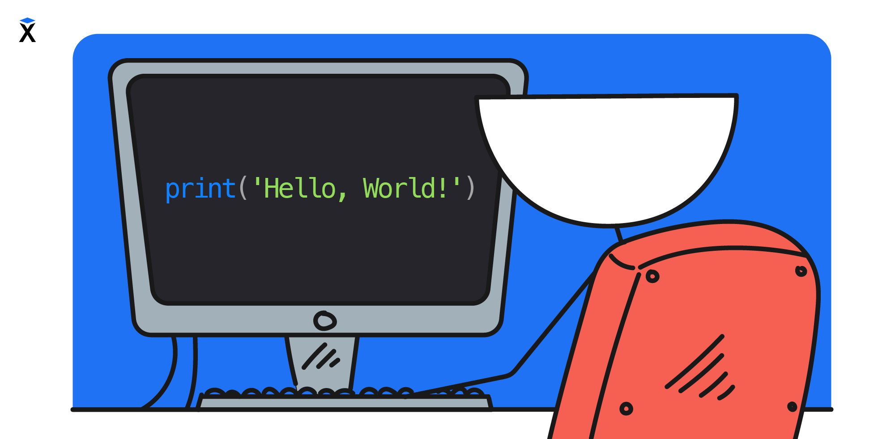

El aprendizaje de un nuevo lenguaje de programación empieza tradicionalmente con el programa 'Hello, World!'. Es un programa simple que muestra un saludo en la pantalla y presenta la sintaxis y la estructura del nuevo lenguaje.

```text
Hello, World!
```



Esta tradición tiene ya más de cuarenta años, y nosotros también empezaremos por ella. En la primera lección escribiremos el programa `Hello, World!`. En Python ese programa se ve así:

```python
print("Hello, World!")
```

El comando `print()` muestra en la pantalla el texto indicado entre paréntesis. En lugar del ejemplo se puede escribir cualquier otro texto.

```python
print("Hexlet - escuela de programación")
```

El comando sigue siendo el mismo, solo cambia el contenido de los paréntesis. Para que el programa entienda que se trata precisamente de texto, este se encierra entre comillas. Se pueden usar comillas simples `'...'` o dobles `"..."`, pero la comilla de apertura y la de cierre deben coincidir.

<!-- NOTE: две формы записи кавычек и есть предмет урока. text чтобы форматтер не свёл их к одной форме -->

```text
print('Hexlet - escuela de programación')
```

El estándar de estilo de código PEP 8 no prefiere las comillas simples ni las dobles: lo importante es elegir un estilo y mantenerlo. En este curso usamos las dobles. PEP 8 aconseja que, si dentro de la cadena hay un apóstrofo o una comilla, se usen las del otro tipo para no escapar nada. Por ejemplo, el apóstrofo de `it's` rompe una cadena entre comillas simples, así que aquí hacen falta las dobles.

```python
print("it's a Python")  # apóstrofo dentro, por eso comillas dobles
```

## El significado de los símbolos

El código está formado por comandos, y cada uno de ellos debe escribirse de una forma determinada. Además de las letras, en el código son importantes las comillas `'` y `"`, los paréntesis `()` y los signos de puntuación. Un signo omitido o confundido hará que el programa no se ejecute. ¿Puedes intentar determinar qué error se cometió en cada una de las líneas?

```python
print("it's a Python"
print(it's a Python")
prin("it's a Python")
print('it's a Python")
prInt("it's a Python")
```

Incluso una pequeña diferencia, por ejemplo una letra de más o un signo distinto, puede hacer que el programa no funcione. Esto también se aplica a las mayúsculas y minúsculas, es decir, a la diferencia entre letras grandes y pequeñas. Mientras que en el texto ordinario `Hola` y `hola` se ven iguales, para Python son palabras diferentes. Python considera `print`, `Print` y `PRINT` como comandos diferentes, y solo funcionará la primera variante.

## Dónde practicar

La teoría se asimila mejor cuando en paralelo ejecutas código y ves el resultado. Para eso sirve la consola interactiva de Python (REPL), donde los comandos se ejecutan línea por línea. Todo lo que aparece en la lección conviene probarlo [en la consola interactiva de Python](https://pyodide.org/en/stable/console.html).

¿Cómo funciona esto técnicamente? Cualquier código escrito se pasa al intérprete de Python, que lo ejecuta y muestra en la pantalla el resultado de su trabajo.

```text
Código           Intérprete            Pantalla
┌──────────┐     ┌─────────────┐     ┌──────────────┐
│ print(…) │ ──→ │   Python    │ ──→ │ Hello, World!│
└──────────┘     └─────────────┘     └──────────────┘
```
