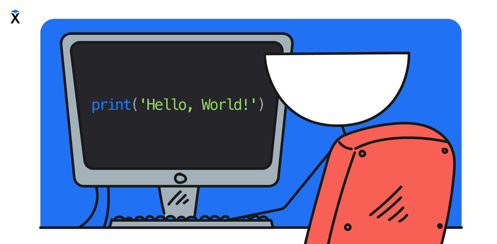

Изучение нового языка программирования традиционно начинается с 'Hello, World!'. Это простая программа, которая выводит приветствие на экран и заодно знакомит с новым языком — его синтаксисом и структурой программы.

```text
Hello, World!
```

Этой традиции уже больше сорока лет, поэтому и мы не будем нарушать ее. В первом уроке мы напишем программу `Hello, World!`. На Python это программа выглядит так:

```python
print('Hello, World!')
```

`print()` — это команда, которая работает по определённому шаблону: в скобках указывается текст для вывода на экран. Мы можем передавать туда любой другой текст.

```python
print('Хекслет - школа программирования')
```

Команда остаётся той же, меняется только содержимое скобок. Чтобы программа понимала, что это именно текст, он заключается в кавычки. Можно использовать одинарные `'...'` или двойные `"..."`, главное — чтобы открывающая и закрывающая кавычки совпадали.

```python
print("Хекслет - школа программирования")
```

По принятому в Python стандарту оформления кода (PEP 8) рекомендуется использовать одинарные кавычки для строк, если внутри них нет апострофа. Это делает код более единообразным.

## Значение символов

Программирование — это не просто текст на английском. Код состоит из команд, и каждая из них должна быть написана в определённой форме. Для этого используются не только буквы, но и специальные символы: кавычки `'` и `"`, скобки `()`, запятая `,`, восклицательный знак `!`. Они не случайные — каждый символ имеет своё значение. Если пропустить знак или перепутать его, программа не запустится.

Даже небольшое отличие, например одна лишняя буква или другой знак, может привести к тому, что программа не будет работать. Это относится и к такому понятию, как регистр — различию между большими и маленькими буквами. Если в обычном тексте `Привет` и `привет` выглядят одинаково, то для Python (как и других языков) это разные слова. Поэтому `print`, `Print` и `PRINT` — это разные команды, и сработает только первый вариант.

## Где практиковаться

Обучение программированию происходит эффективнее, когда помимо чтении теории и выполнении заданий, вы будете практиковаться вызывая код в специальной среде (интерактивная оболочка или REPL), где можно выполнять код на Python построчно. Регулярно повторяйте все что вы видите в уроке [тут](https://pyodide.org/en/stable/console.html)
