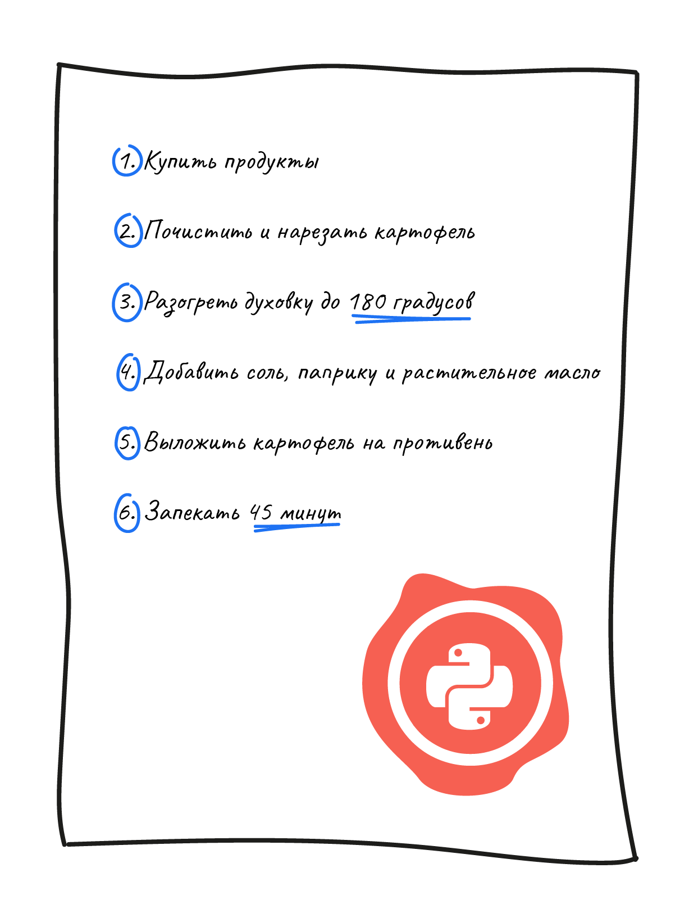

Когда мы готовим блюдо, то следуем рецепту шаг за шагом. Пропустим этап — и результат будет отличаться от ожидаемого. В программировании работает тот же принцип: чёткий порядок инструкций определяет, как работает программа.

Инструкция (или оператор) — это команда для компьютера. Она говорит: «сделай что-то прямо сейчас». Интерпретатор Python (специальная программа, которая понимает и выполняет код) выполняет код сверху вниз, по строкам. Он обрабатывает каждую инструкцию по очереди, как если бы читал рецепт по шагам.

Вот пример кода с двумя инструкциями. Эти строки говорят компьютеру: «Выведи фразу на экран».

```python
print('Mother of Dragons.') # Первая инструкция
print('Dracarys!') # Вторая инструкция
```

Результат выполнения:

```text
Mother of Dragons.
Dracarys!
```

## Порядок имеет значение

Интерпретатор Python исполняет код в строгом порядке — как вы его написали. Если поменять местами строки:

```python
print('Dracarys!')
print('Mother of Dragons.')
```

то и на экране они поменяются:

```text
Dracarys!
Mother of Dragons.
```

## Альтернативная форма записи

Обычно инструкции пишутся на отдельных строках, но Python допускает объединение нескольких инструкций в одну строку с помощью ;:

```python
print('Mother of Dragons.'); print('Dracarys!');
```

Обе версии работают одинаково, но второй вариант хуже читается. В реальных проектах принято писать инструкции построчно — это повышает читаемость и упрощает поддержку кода.
