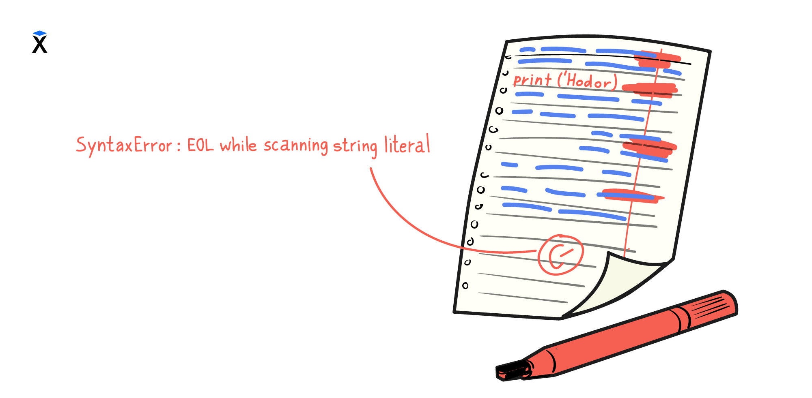

Si un programa en Python está escrito violando las reglas, el intérprete detendrá la ejecución y mostrará un mensaje de error. En ese mensaje se indica:

- El tipo de error,
- la línea en la que ocurrió,
- y (a menudo) el punto donde el intérprete «se tropezó».

## ¿Qué es un error de sintaxis?

Un error de sintaxis (SyntaxError) es una violación de las reglas de escritura del código (las reglas gramaticales) en un lenguaje de programación concreto. Esos errores aparecen si el código está escrito desviándose del formato esperado, por ejemplo si no se cerró una cadena, se omitió un paréntesis, se alteró el orden de los símbolos, etc.



A diferencia de las lenguas naturales, donde un texto con errores se puede entender por el contexto, en programación incluso la mínima desviación deja el código inservible.

```text
Código con error       Intérprete              Resultado
┌──────────────┐      ┌─────────────┐      ┌──────────────────┐
│ print('Hi'   │  ──> │   Python    │  ──> │ SyntaxError:     │
└──────────────┘      └─────────────┘      │ unexpected EOF   │
                                           └──────────────────┘
```

Veamos un ejemplo simple con un error de sintaxis:

```python
# La variante correcta es esta: print('Hodor')
print('Hodor)
```

En este código no se cerró la comilla, lo que hace que el programa sea incorrecto desde el punto de vista de la sintaxis. Intentemos ejecutar el programa y el intérprete dará un error:

```console
$ python index.py
  File "index.py", line 2
    print('Hodor)
          ^
SyntaxError: unterminated string literal (detected at line 2)
```

El texto, por falta de costumbre, puede resultar incomprensible, pero eso es normal: cuanto más te encuentres con esos errores, más entenderás a primera vista qué ocurrió.

## ¿Por qué esos errores se consideran simples?

Los errores de sintaxis:

- son fáciles de notar: el código a menudo se resalta en el editor;
- son fáciles de corregir: basta con devolver el símbolo omitido o arreglar la estructura.

Pero hay un pero. El intérprete no siempre señala exactamente el lugar donde se cometió el error. A veces el problema está unas líneas más arriba. Por ejemplo, un paréntesis abierto pero no cerrado en una línea puede «romper» todo el código siguiente.

## ¿Qué hacer ante un error de sintaxis?

- Lee el mensaje de error. Casi siempre contiene información útil.
- Comprueba la línea indicada en el mensaje y la línea anterior: a veces el error está «escondido» un poco antes.
- Usa un [editor con resaltado de sintaxis](https://code.visualstudio.com/): te ayudará a notar los problemas de inmediato (por ejemplo, comillas o paréntesis sin cerrar).
