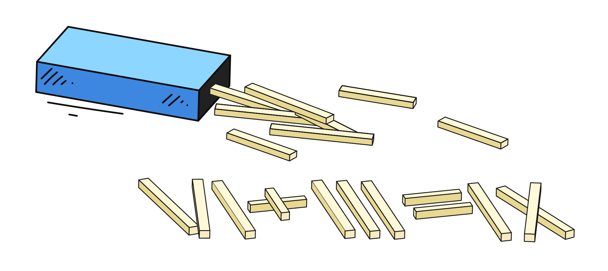

En el nivel básico, los ordenadores solo trabajan con números. Incluso si escribes una aplicación compleja en un lenguaje de programación moderno, dentro de ella siempre ocurren numerosos cálculos: sumas, restas, divisiones, etc.



Por suerte, para empezar a programar basta con conocer la aritmética escolar corriente. Por ella empezaremos.

## La suma en Python

En matemáticas, para sumar escribimos 3 + 4. En Python es exactamente igual:

```python
3 + 4
```

Ese código se puede ejecutar realmente: el intérprete hará el cálculo. Pero… no hará nada con el resultado. Es decir, el 7 se obtendrá, pero tú no lo verás.

## Para ver el resultado hay que mostrarlo

En un programa real no basta con calcular el valor. Hay que hacer algo con el resultado, por ejemplo mostrárselo al usuario.

Para eso usamos el ya habitual comando `print()`, al que en adelante llamaremos función:

```python
print(3 + 4)
```

Aquí primero se calcula la suma y después se pasa a la función de impresión.

```text
print(3 + 4)
      └─┬─┘
        7

print(7)  →  7
```

El resultado de la ejecución:

```text
7
```

Si se escribe esa misma expresión como cadena, obtendremos un resultado completamente distinto: se mostrará la cadena «tal cual»:

```python
print("3 + 4")  # muestra: 3 + 4
print(3 + 4)  # muestra: 7
```

## Otras operaciones aritméticas

Python admite todas las operaciones habituales más algunas específicas, relacionadas con cómo se guardan y procesan los números en el ordenador:

| Operación            | Símbolo | Ejemplo  | Resultado |
| -------------------- | ------- | -------- | --------- |
| Suma                 | `+`     | `2 + 3`  | `5`       |
| Resta                | `-`     | `7 - 2`  | `5`       |
| Multiplicación       | `*`     | `4 * 3`  | `12`      |
| División             | `/`     | `8 / 2`  | `4.0`     |
| Potenciación         | `**`    | `3 ** 2` | `9`       |
| División entera      | `//`    | `7 // 3` | `2`       |
| Resto de la división | `%`     | `7 % 3`  | `1`       |

Así se puede mostrar el resultado de una división y de una potenciación:

```python
print(8 / 2)  # => 4.0
print(3**2)  # => 9
```

## Números de punto flotante

Además de los números enteros, en Python hay números de punto flotante, que se usan para trabajar con fracciones. Esos números se escriben con punto:

```python
print(3.5 + 1.2)  # => 4.7
print(10 / 4)  # => 2.5
```

A veces los usamos nosotros mismos, cuando hay que trabajar precisamente con valores fraccionarios, por ejemplo al calcular una media o al trabajar con dinero y medidas. Pero los números de punto flotante pueden aparecer también por sí solos, por ejemplo como resultado de la operación de división `/`:

```python
print(8 / 2)  # => 4.0
print(7 / 2)  # => 3.5
```

Aquí Python siempre devuelve un resultado fraccionario, incluso si matemáticamente la respuesta salió entera.

La razón de separar esto en un tipo aparte: el ordenador necesita guardar los valores enteros y los fraccionarios de forma distinta. Para los enteros reserva unas estructuras en memoria, para los fraccionarios reserva otras. Por eso en Python, igual que en otros lenguajes de programación, existen dos clases distintas de números: int (enteros) y float (de punto flotante).

En el nivel básico basta con recordar: los números enteros hacen falta cuando no hay fracciones, y los de punto flotante cuando sí las hay. Más adelante en el curso los veremos en detalle.

## Qué es el resto de la división (`%`)

Esta operación se llama **tomar el resto de la división**. Muestra **qué "queda"** cuando un número se divide por otro _no del todo_. Un ejemplo:

```python
print(7 % 3)  # => 1
```

¿Por qué el resultado es igual a 1?

- 7 se divide por 3 dos veces: 3 * 2 = 6
- Hasta 7 queda 1, y eso es el resto.

Otros ejemplos:

```python
print(10 % 4)  # => 2 (10 se divide por 4 dos veces: 4 * 2 = 8, resto 2)
print(15 % 5)  # => 0 (se divide sin resto)
```

La operación % se usa a menudo en programación, por ejemplo:

- para comprobar si un número se divide de forma exacta (si el resto es 0)
- para realizar acciones cíclicas, por ejemplo un comportamiento según índices pares o impares

Nos encontraremos con % más de una vez en las tareas y veremos su uso en la práctica.

## El formato de las expresiones aritméticas

Desde el punto de vista de Python, entre `3+4` y `3 + 4` no hay diferencia. El intérprete entenderá las dos variantes igual y en ambos casos hará la suma. La diferencia está solo en el formato del código. En programación se acostumbra a poner espacios alrededor de los operadores aritméticos, porque así las expresiones son más fáciles de leer:

```python
3 + 4
8 / 2
7 % 3
```

La variante sin espacios también funciona:

<!-- NOTE: запись без пробелов и есть предмет примера. text чтобы форматтер не расставил пробелы -->

```text
3+4
8/2
7%3
```

Pero ese código se ve menos cuidado y cuesta más percibirlo rápido. Por eso conviene acostumbrarse desde el principio a escribir con espacios alrededor de los operadores.
