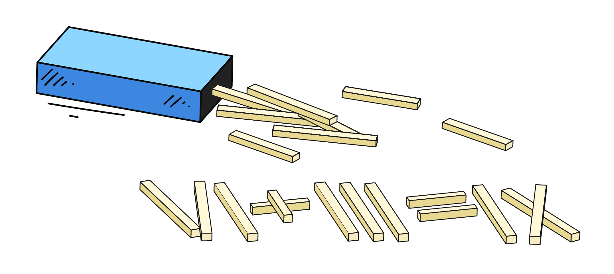

На базовом уровне компьютеры работают только с числами. Даже если вы пишете сложное приложение на современном языке программирования, внутри него всегда происходят многочисленные вычисления: сложение, вычитание, деление и т.д.

К счастью, чтобы начать программировать, достаточно знать обычную школьную арифметику. С неё мы и начнём.

## Сложение в Python

В математике для сложения мы пишем 3 + 4. В Python — всё точно так же:

```python
3 + 4
```

Этот код действительно можно запустить — интерпретатор выполнит вычисление.
Но... он не сделает с результатом ничего. То есть 7 получится, но вы его не увидите.

## Чтобы увидеть результат, нужно его вывести

В реальной программе просто посчитать значение — недостаточно. Нужно сделать что-то с результатом, например, показать его пользователю.

Для этого используем функцию `print()`:

```python
print(3 + 4)
```

💡 Здесь сначала вычисляется сумма, затем она передаётся в функцию печати.

Результат выполнения:

```text
7
```

Если записать это же выражение в виде строки, то мы получим совсем другой результат, на печать будет выведена строка "как есть":

```python
print('3 + 4') # выводит: 3 + 4
print(3 + 4)    # выводит: 7
```

## 🧮 Другие арифметические операции

Python поддерживает все привычные операции + несколько специфичных, связанных с тем, как хранятся и обрабатываются числа на компьютере:

| Операция               | Символ | Пример       | Результат |
|------------------------|--------|--------------|-----------|
| Сложение               | `+`    | `2 + 3`      | `5`       |
| Вычитание              | `-`    | `7 - 2`      | `5`       |
| Умножение              | `*`    | `4 * 3`      | `12`      |
| Деление                | `/`    | `8 / 2`      | `4.0`     |
| Возведение в степень   | `**`   | `3 ** 2`     | `9`       |
| Целочисленное деление  | `//`   | `7 // 3`     | `2`       |
| Остаток от деления     | `%`    | `7 % 3`      | `1`       |


Вот как можно вывести результат деления и возведения в степень:

```python
print(8 / 2)    # => 4.0
print(3 ** 2)   # => 9
```

## Числа с плавающей точкой

Помимо целых чисел в Python есть и числа с плавающей точкой — они используются для работы с дробями. Такие числа записываются через точку:

```python
print(3.5 + 1.2)   # => 4.7
print(10 / 4)      # => 2.5
```

Иногда мы используем их сами, когда нужно работать именно с дробными значениями, например при подсчёте среднего или при работе с деньгами и измерениями. Но числа с плавающей точкой могут появляться и сами, например, в результате операции деления `/`:

```python
print(8 / 2)   # => 4.0
print(7 / 2)   # => 3.5
```

Здесь Python всегда возвращает дробный результат, даже если математически ответ получился целым.

Почему это отдельный тип чисел, а не «просто числа»? Потому что компьютеру нужно хранить и целые значения, и дробные значения по-разному. Для целых он выделяет одни структуры в памяти, для дробных — другие. Поэтому в Python, как и в других языках программирования есть два разных вида чисел: int (целые) и float (с плавающей точкой).

На базовом уровне достаточно помнить: целые числа нужны, когда нет дробей, а числа с плавающей точкой — когда они есть. Подробнее мы разберемся с ними дальше по курсу.

## ℹ️ Что такое остаток от деления (`%`)

Эта операция называется **взятие остатка от деления**. Она показывает, **что «остаётся»**, когда одно число делится на другое *не полностью*. Пример:

```python
print(7 % 3)  # => 1
```

📘 Почему результат — 1?

- 7 делится на 3 дважды: 3 * 2 = 6
- До 7 остаётся 1 — это и есть остаток.

Другие примеры:

```python
print(10 % 4)  # => 2 (10 делится на 4 дважды: 4 * 2 = 8, остаток 2)
print(15 % 5)  # => 0 (делится без остатка)
```

Операция % часто используется в программировании, например:

- чтобы проверить, делится ли число нацело (если остаток 0)
- чтобы выполнять циклические действия, например, поведение по чётным/нечётным индексам

Мы ещё неоднократно встретим % в задачах и разберём его применение на практике.
