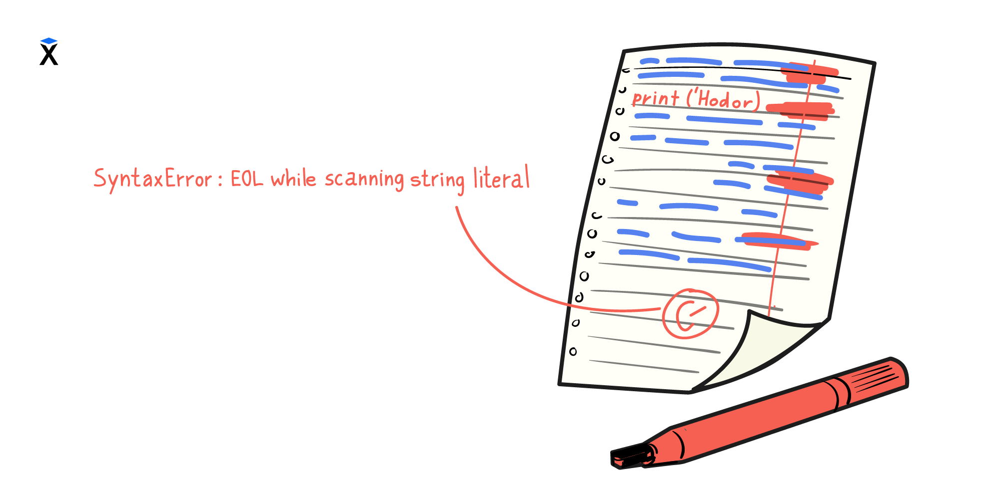

Вы уже умеете писать простые программы. Теперь стоит разобраться с тем, как писать код, чтобы его было легко читать и поддерживать. Это важный навык, особенно если вы работаете не в одиночку.

Когда разные разработчики пишут в разном стиле, код становится трудночитаемым: где-то пробел лишний, где-то отступы разные, а где-то переменные называются непонятно. Чтобы избежать хаоса, программисты договорились соблюдать единый стиль кодирования. Это свод правил, которые описывают, как должен выглядеть код — от расстановки пробелов до оформления функций и названий переменных.

Придерживаться единого стиля — значит писать код, который одинаково понятен всем членам команды, независимо от того, кто его написал. Это экономит время, снижает количество ошибок и упрощает совместную работу.

## Стандарты кодирования

В языке Python есть официальный стиль кодирования — это документ PEP8. Он подробно описывает, как оформлять код: какие отступы использовать, как расставлять пробелы, какой длины должны быть строки, как называть переменные и многое другое.

Этот стандарт знают и используют все Python-разработчики. Новичкам полезно время от времени заглядывать в него и вырабатывать правильные привычки с самого начала. Однако запомнить всё сразу невозможно — да и не нужно.

## Линтеры: автоматическая проверка кода

Запоминать все правила вручную не нужно. Существуют специальные программы, которые делают это за вас. Они называются линтеры.

🔍 Линтер — это инструмент, который анализирует ваш код и сообщает о нарушениях стандартов.
Он помогает:

- Избавиться от лишних пробелов
- Не забыть отступы
- Писать читаемые выражения
- И просто делать код красивее

## Современный линтер: Ruff

На сегодняшний день самым быстрым и популярным линтером в мире Python считается Ruff. Он объединяет в себе правила из многих других инструментов: flake8, isort, pylint, black и других. Ruff быстро работает, поддерживает современный синтаксис и активно развивается.

Рассмотрим пример:

```python
result = 1+ 3
```

Такой код выглядит неаккуратно, и линтер справедливо укажет на ошибку:

```text
E225: missing whitespace around operator
```

Это значит, что перед и после + не хватает пробелов. Согласно стандарту, должно быть так:

```python
result = 1 + 3
```

## Правила и их смысл

Каждое сообщение линтера связано с конкретным правилом. Например, E225 касается пробелов, E302 — пустых строк перед функциями, а E501 — длины строк. Когда вы только начинаете, такие мелочи могут казаться неважными. Но со временем становится понятно, что именно они формируют единый читаемый стиль.

С полным списком правил Ruff можно ознакомиться в [официальной документации](https://docs.astral.sh/ruff/rules/).

## Использование линтера в своих проектах

Когда вы начнёте писать собственные проекты за пределами учебной платформы, линтер будет незаменимым помощником. Его можно настроить в любом редакторе кода, запустить в терминале или подключить к сборке проекта. Он не только показывает ошибки, но и умеет их исправлять автоматически.
