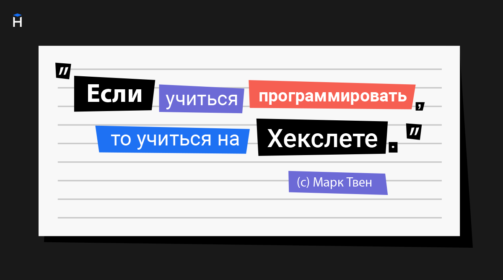

Строки в программировании на Python используются очень часто и в самых разных ситуациях. С их помощью мы работаем с текстом: выводим сообщения на экран, обрабатываем пользовательский ввод, читаем данные из файлов, формируем запросы к базам данных или внешним системам.

С точки зрения Python, строка — это просто набор символов, заключённый в кавычки. Посмотрим на примеры:

```python
'Hello'
'Goodbye'
'G'
' '
''
```

Все эти варианты — строки.

- `'Hello'` и `'Goodbye'` — это строки из нескольких символов.
- `'G'` — строка из одного символа.
- `' '` — строка, состоящая из одного пробела.
- `''` — пустая строка, в ней нет ни одного символа. Играет такую же роль, как 0 в математике

То есть всё, что находится внутри кавычек, считается строкой: даже если там только пробел или вообще ничего нет.

Если вывести строки на экран, то `'Hello'` и `'Goodbye'` будут хорошо заметны. Но `'` ' и `''` могут сбивать с толку: пустая строка ничего не покажет, а строка с пробелом покажет «пустое место», которое визуально сложно отличить. При этом Python чётко различает их: пустая строка — это отсутствие символов, а строка с пробелом содержит конкретный символ пробела.

Этим языки программирования отличаются от разговорных языков: здесь нет места для интерпретаций. В обычных языках человек может по-разному понять сказанное, уловить смысл даже при неточностях или пропусках. В коде такого не бывает — строка всегда трактуется однозначно.

Контрольный вопрос. Это одинаковые строки или нет?

```python
'хекслет'
' хекслет'
```

## 📚 Терминология: строка или строчка?

В программировании есть терминологическая ловушка:

- Строка (string) — это тип данных (то что разбирали выше), например 'hello'.
- Строчка (line) — это строка текста в файле или в коде.

Например, в коде ниже есть строчка, но не строка:

```python
print(5)
```

Чтобы избежать путаницы, в этом курсе мы будем использовать:

- Строка — когда говорим о типе данных.
- Строчка — когда речь идёт о строках кода.

## Одинарные и двойные кавычки

В Python строки можно записывать как в одинарных, так и в двойных кавычках:

```python
print('Hello')
print("Hello")
```

Оба варианта работают одинаково. Главное — использовать один и тот же тип кавычек в начале и в конце строки.

Хотя Python поддерживает оба варианта, по умолчанию принято использовать одинарные кавычки `'`, если внутри строки не требуется двойных. Этого стиля придерживается официальный стандарт оформления кода *PEP8*.

## Проблема с кавычками внутри строки

Представьте, что вы хотите напечатать строку *Dragon's mother*. В ней есть апостроф (*'s*) — это тот же символ, что и одинарная кавычка. Попробуем так:

```python
print('Dragon's mother')
# SyntaxError: invalid syntax
```

Python решит, что строка заканчивается после слова 'Dragon', а остальное не распознает как валидный код — возникнет синтаксическая ошибка. Чтобы избежать этого, обернём строку в двойные кавычки:

```python
print("Dragon's mother")
```

Теперь Python понимает, что одинарная кавычка внутри строки — это обычный символ, а сама строка начинается и заканчивается двойными кавычками.

Если внутри строки нужны двойные кавычки, а снаружи — одинарные, проблем тоже не будет:

```python
print('He said "No"')
```

Иногда в строке встречаются оба типа кавычек:

```python
Dragon's mother said "No"
```

В этом случае чтобы Python не спутал кавычки внутри строки с внешними, используют символ экранирования — обратный слэш `\`. Он говорит интерпретатору: следующий за ним символ — часть строки, а не управляющий символ.

```python
print("Dragon's mother said \"No\"")
# => Dragon's mother said "No"
```

Здесь мы экранируем двойные кавычки внутри строки, заключённой в двойные кавычки.

Обратите внимание: Python воспринимает `\"` как один символ — кавычку, а не два символа.
То же самое касается `\'`, `\\`, `\n` и других управляющих последовательностей — они выглядят как два символа в коде, но в строке считаются за один.

То же самое работает и в обратном случае:

```python
print('Dragon\'s mother said "No"')
# => Dragon's mother said "No"
```

## Как вывести обратный слэш

Чтобы вывести сам обратный слэш, его тоже нужно экранировать:

```python
print("\\")
# => \
```
