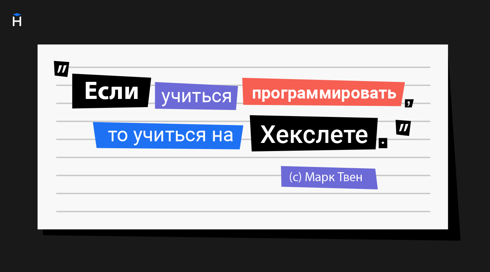

Строки в программировании на Python используются очень часто и в самых разных ситуациях. С их помощью мы работаем с текстом, выводим сообщения на экран, обрабатываем пользовательский ввод и взаимодействуем с внешними системами.



С точки зрения Python строка представляет собой просто набор символов, заключенный в кавычки. Посмотрим на примеры.

```python
'Hello'
'Goodbye'
'G'
' '
''
```

Все эти варианты являются строками.

- `'Hello'`, `'Goodbye'` и `'G'` представляют собой строки из нескольких или одного символа.
- `' '` является строкой, состоящей из одного пробела.
- `''` является пустой строкой, в ней нет ни одного символа. Играет такую же роль, как 0 в математике.

То есть все, что находится внутри кавычек, считается строкой, даже если там только пробел или вообще ничего нет.

Если вывести строки на экран, то `'Hello'` и `'Goodbye'` будут хорошо заметны. Но `' '` и `''` могут сбивать с толку, потому что вывод пустой строки выглядит как полное отсутствие, а строка с пробелом покажет "пустое место", которое визуально сложно отличить. При этом Python четко различает их. Пустая строка означает отсутствие символов, тогда как строка с пробелом содержит конкретный символ пробела.

Контрольный вопрос. Это одинаковые строки или нет?

```python
'хекслет'
' хекслет'
```

## Терминология. Строка или строчка?

В программировании есть терминологическая ловушка.

- Строка (string) является типом данных (то что разбирали выше), например 'hello'.
- Строчка (line) является строкой текста в файле или в коде.

Например, в коде ниже есть строчка, но не строка.

```python
print(5)
```

Чтобы избежать путаницы, в этом курсе мы будем использовать такие формулировки.

- Строка, когда говорим о типе данных.
- Строчка, когда речь идет о строках кода.

## Одинарные и двойные кавычки

В Python строки можно записывать как в одинарных, так и в двойных кавычках.

```python
print('Hello')
print("Hello")
```

По умолчанию принято использовать одинарные кавычки `'`, если внутри строки не требуется двойных. Этого стиля придерживается официальный стандарт оформления кода *PEP8*.

## Проблема с кавычками внутри строки

Представьте, что вы хотите напечатать строку *Dragon's mother*. В ней есть апостроф (*'s*), совпадающий с символом одинарной кавычки. Попробуем так.

```python
print('Dragon's mother')
# SyntaxError: invalid syntax
```

Python решит, что строка заканчивается после слова 'Dragon', а остальное не распознает как валидный код, что вызовет синтаксическую ошибку. Чтобы избежать этого, обернем строку в двойные кавычки.

```python
print("Dragon's mother")
```

Теперь Python понимает, что одинарная кавычка внутри строки является обычным символом, а сама строка начинается и заканчивается двойными кавычками.

Если внутри строки нужны двойные кавычки, а снаружи одинарные, проблем тоже не будет.

```python
print('He said "No"')
```

Иногда в строке встречаются оба типа кавычек.

```python
Dragon's mother said "No"
```

В этом случае чтобы Python не спутал кавычки внутри строки с внешними, используют символ экранирования, обратный слэш `\`. Он говорит интерпретатору, что следующий за ним символ является частью строки, а не управляющим символом.

```python
print("Dragon's mother said \"No\"")
# => Dragon's mother said "No"
```

Здесь мы экранируем двойные кавычки внутри строки, заключенной в двойные кавычки.

Обратите внимание, Python воспринимает `\"` как один символ-кавычку, а не два символа.
То же самое касается `\'`, `\\`, `\n` и других управляющих последовательностей. Они выглядят как два символа в коде, но в строке считаются за один.

То же самое работает и в обратном случае.

```python
print('Dragon\'s mother said "No"')
# => Dragon's mother said "No"
```

## Как вывести обратный слэш

Чтобы вывести сам обратный слэш, его тоже нужно экранировать.

```python
print("\\")
# => \
```
