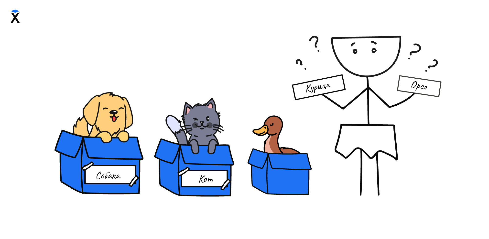

Представьте, что у нас есть такая программа:

```python
x = 'Father!'
print(x)
```

С технической точки зрения все работает. Мы уже видели похожие примеры, но здесь используется переменная с названием `x`. Плохие имена мешают читать и понимать код. Вот несколько примеров неудачных переменных:

```python
a = "John"
n = 42
ddr = "New York"
```

Что это за переменные? Что в них хранится? Чтобы это понять, нужно читать весь остальной код и догадываться по контексту.



Компьютеру все равно, как называется переменная. Для него `x`, `abc`, `message` или `elephant_in_the_room` являются просто метками для хранения данных. Людям важно другое. Программисты читают код гораздо чаще, чем пишут. Поэтому имена переменных являются важной частью общения через код.

## Хорошие примеры

```python
user_name = "Arya Stark"
unpaid_orders_count = 3
max_attempts = 5
```

Хорошее имя переменной помогает понять, что делает программа, не вчитываясь в каждую строчку.
Особенно важно давать такие имена, смысл которых понятен без контекста, без необходимости читать весь код вокруг.

Вот несколько советов:

- Используйте английский язык. Это международный стандарт. Лучше писать `orders_count` вместо `kolvo_zakazov`. Если с английским пока сложно, используйте переводчик, это нормально. Со временем станет проще.
- Старайтесь, чтобы имя отражало смысл переменной. Пусть оно будет чуть длиннее, но понятное.
- Не бойтесь тратить время на подбор хорошего названия. Это инвестиция в читаемость и поддержку кода.

Среди программистов даже есть шутка: "Одними из самых трудных задач в программировании являются кэширование и придумывание имен переменным." Иногда придумать подходящее имя действительно сложно. Вот пример: как бы вы назвали переменную, в которой хранится количество неоплаченных заказов от клиентов с задолженностью за предыдущий квартал?

А теперь небольшое упражнение: Придумайте название для переменной, в которой будет храниться "количество братьев и сестер короля". Запишите его в блокноте или отправьте себе на почту. Только название, без объяснений. Мы вернемся к этому заданию через несколько уроков.
