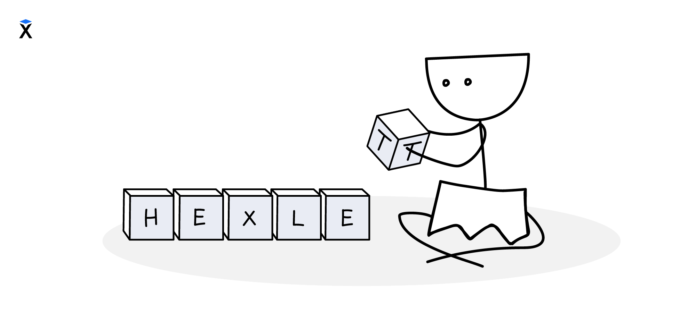

A veces hace falta obtener un solo carácter de una cadena. Por ejemplo, si el sitio conoce el nombre y el apellido del usuario y hay que mostrarlos en formato abreviado, del tipo A. Ivanov. Para eso se necesita tomar la primera letra del nombre.



En Python, para acceder a los caracteres de una cadena se usa la indexación. La indexación significa que cada carácter de la cadena tiene su propio número, es decir, su índice. La indexación empieza en cero: el primer carácter tiene el índice `0`, el segundo el `1` y así sucesivamente. Imaginemos que tenemos una cadena:

```python
first_name = "Alexander"
```

Para obtener la primera letra, indicamos su posición (el índice) entre corchetes:

```python
print(first_name[0])  # => A
```

Los índices en Python (y en muchos lenguajes) empiezan en cero:

```text
Carácter	A	l	e	x	a	n	d	e	r
Índice	0	1	2	3	4	5	6	7	8
```

La longitud de la cadena `Alexander` es `9`, por eso el índice del último carácter es `8`, es decir, `9 - 1`.

Para obtener, por ejemplo, el último carácter, se puede escribir:

```python
print(first_name[8])  # => r
```

Si cambia la longitud de la cadena, el último elemento también se desplaza y habrá que indicar el nuevo índice en el que está ese carácter.

Y si se sale de los límites de la cadena, obtendremos un error:

```python
print(first_name[9])
# IndexError: string index out of range
```

Por eso, en programación se acostumbra a comprobar la longitud de la cadena y acceder a sus caracteres solo cuando es seguro. Llegaremos a eso en lecciones futuras.

## Extracción abreviada desde el final

Para obtener elementos desde el final es mejor usar índices negativos. En ese caso la cuenta empieza por el final.

```python
print(first_name[-1])  # => r, el último carácter
print(first_name[-2])  # => e, el penúltimo carácter
```

```text
Cadena:   'H' 'e' 'x' 'l' 'e' 't'
Índice:    0   1   2   3   4   5
Del final:-6  -5  -4  -3  -2  -1
```

Los índices negativos funcionan así:

- -1 corresponde al último carácter
- -2 corresponde al penúltimo
- y así sucesivamente

Es cómodo y seguro, porque funciona correctamente incluso si la cadena cambia de longitud.

El índice se puede guardar en una variable:

```python
index = 0
print(first_name[index])  # => A
```

Este enfoque es útil cuando el índice se calcula en algún lugar del código y después se usa para acceder al carácter necesario.

## Caracteres especiales

En la indexación se cuentan las letras normales, los signos y los caracteres especiales. Todos ocupan una posición en la cadena y tienen su índice, aunque «no se vean» en la pantalla.

Por ejemplo, en la cadena `\nyou` el primer carácter es `\n` (el salto de línea), y en el índice 1 ya está la letra `y`. Por eso el acceso `magic[1]` devolverá precisamente `y`.

## Piensa: ¿qué mostrará este código?

```python
magic = "\nyou"
print(magic[1])  # => ?
```

La salida será:

```text
y
```
