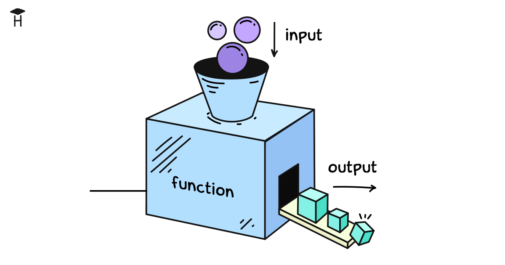

La programación sirve para ejecutar las operaciones más diversas. A veces son acciones simples, por ejemplo sumar números o unir cadenas. Pero más a menudo son procesos complejos, como transferir dinero de una cuenta a otra, tramitar un pedido en una tienda en línea, calcular impuestos o preparar un informe.

Esas operaciones no se pueden expresar con una sola instrucción. Detrás de una acción como "transferir dinero" pueden esconderse decenas, cientos e incluso miles de líneas de código. Es la comprobación del saldo, el cargo del importe, el cálculo de la comisión, la actualización de la base de datos, el envío de la notificación al usuario.

Para gobernar ese código y no perderse en los detalles se usan las funciones. Una función agrupa un bloque de código en un todo único, oculta la implementación y permite concentrarse en el sentido. Al programador le basta con llamar a la función y confiarle todo el trabajo interno.



Imaginemos una función que transfiere dinero de una cuenta a otra. En realidad, dentro de ella puede haber cientos de líneas de código, pero nosotros no lo vemos. Por fuera todo se ve como una única instrucción simple:

```python
transfer_money('Alice', 'Bob', 100)
```

Esa línea llama a la función `transfer_money()`. Se le pasan el remitente `Alice`, el destinatario `Bob` y el importe `100`.

Aquí hay algunos ejemplos más de llamadas a funciones que podríamos implementar. Cada función tiene su nombre y su propio conjunto de datos para trabajar.

```python
# Sí, sí, print también es una función
print('Hexlet!')

# Envío de un correo al usuario
send_email('bob@example.com', 'Bienvenido!')

# Cálculo del impuesto sobre el importe indicado
calculate_tax(5000, 'Florida')

# Comprobación de si el usuario está en el sistema
is_registered('Alice')

# Obtención de un número aleatorio del 1 al 10
random_number(1, 10)

# Creación de una copia de seguridad de la base de datos
backup_database()

# Cálculo de la longitud de una cadena
len('Hexlet') # Resultado: 6
```

En la llamada a una función se escribe primero su **nombre** y luego los **paréntesis**. Los paréntesis muestran que se trata precisamente de una llamada. Así entendemos que ante nosotros hay una función y no una variable.

Dentro de los paréntesis se indican los **argumentos**, es decir, los datos que la función recibe para trabajar. Pueden ser varios, uno o ninguno en absoluto.

## ¿De dónde salen las funciones?

Unas funciones están incorporadas en el lenguaje (built-in) y otras las crean los propios programadores.

Las **funciones incorporadas** son funciones que vienen junto con el lenguaje Python. Se pueden usar de inmediato, sin acciones adicionales. Como ejemplo se puede citar la función `print()`. Como se dice, está disponible globalmente.

Las **funciones definidas por los programadores** se crean cuando hace falta encapsular la lógica propia en un bloque aparte. A esa función se le puede poner cualquier nombre y usarla en el código igual que las incorporadas. Aprenderemos a hacerlo más adelante.

Además, existen funciones que se encuentran en bibliotecas aparte. Para usarlas hay que conectarlas mediante el mecanismo de importación. La importación no la analizamos todavía en detalle. Por ahora basta con saber que permite conectar un conjunto externo de funciones y hacerlas accesibles en el programa.

## Función con un parámetro

Una de las funciones incorporadas que se usan con más frecuencia es `len()`. Para una cadena devuelve la cantidad de caracteres.

```python
message = 'Hello!'
count = len(message)
print(count) # => 6
```

Aquí la cadena `'Hello!'` tiene seis caracteres, por eso la llamada `len(message)` devolverá el número `6`.

```text
Argumentos         Función          Resultado
┌──────────┐     ┌──────────┐     ┌──────────┐
│ 'Hello!' │ ──→ │  len()   │ ──→ │    6     │
└──────────┘     └──────────┘     └──────────┘
```

## Devolución del valor

La devolución del valor es uno de los principios clave del funcionamiento de las funciones. Gracias a ella podemos unir los resultados de distintas acciones y construir una lógica más compleja. Si una función devuelve un valor, podemos guardarlo en una variable, pasarlo a otra función o usarlo en cálculos. Así funciona precisamente `len()`. Cuenta la cantidad de elementos y entrega el resultado hacia fuera.

```python
message1 = 'Hello!'
length1 = len(message1) # guardamos el resultado

message2 = 'World!'
length2 = len(message2)

combined_length = length1 + length2 # usamos el resultado en una expresión
print(combined_length) # 12
```

Si `len()` imprimiera el resultado en pantalla de inmediato (como hace `print()`), veríamos el número, pero no podríamos usarlo:

```python
# función imaginaria que solo imprime el resultado
fake_len('Hello!') # imprimirá 6

# pero más adelante ese número ya no está disponible
# no podemos sumarlo, guardarlo ni compararlo
result = fake_len('Hello!') # aquí en result no hay nada
```

Por eso la devolución del valor es un concepto tan importante. Permite enlazar las funciones entre sí. Unas devuelven datos y otras los usan en su trabajo. Así es precisamente como, a partir de pasos pequeños, se construyen programas grandes y complejos.

## Función con varios parámetros

Algunas funciones reciben a la vez varios datos para trabajar. Como ejemplo sirve la función incorporada `pow()`, que eleva un número a la potencia necesaria. El primer parámetro recibe la base de la potencia y el segundo fija el exponente.

```python
# elevamos 2 a la 3.ª potencia: 2 * 2 * 2
result = pow(2, 3)
print(result) # => 8

# 5 a la 2.ª potencia: 5 * 5
print(pow(5, 2)) # => 25
```

Por su estructura, una llamada con varios parámetros no se diferencia de una llamada con uno. El mismo nombre de la función, los paréntesis y los argumentos separados por comas dentro.

## Parámetros y argumentos

En las conversaciones sobre funciones aparecen a cada rato las palabras **parámetros** y **argumentos**. Están relacionadas, pero no son lo mismo.

De **parámetros** se habla al crear la función. Se llama parámetro a la variable dentro de la función en la que cae el valor pasado. De **argumentos** se habla al llamarla. Se llama argumento a lo que pasamos a la función. Puede ser un número, una variable o cualquier expresión.

```python
# números como argumentos
print(pow(2, 3)) # => 8

x = 2
# el argumento puede ser una expresión: se evaluará antes de pasarla a la función
print(pow(x + 1, 3)) # => 27
```

Memorizarlo no es obligatorio, pero servirá al leer literatura en inglés.
