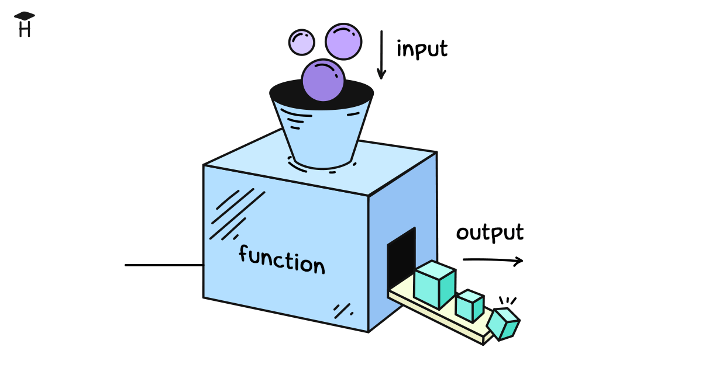

Программирование нужно для того, чтобы выполнять самые разные операции. Иногда это простые действия, например сложение чисел или объединение строк. Но чаще речь идёт о сложных процессах: перевод денег со счёта на счёт, оформление заказа в интернет-магазине, расчёт налогов или подготовка отчёта.

Такие операции невозможно выразить одной командой. За действием вроде «перевести деньги» может скрываться десятки, сотни и даже тысячи строк кода: проверка баланса, списание суммы, учёт комиссии, обновление базы данных, отправка уведомления пользователю.

Чтобы управлять этим кодом и не теряться в деталях, используют функции. Функция объединяет блок кода в единое целое, прячет реализацию и позволяет сосредоточиться на смысле. Для программиста достаточно вызвать функцию и доверить ей всю внутреннюю работу.

Представим функцию, которая переводит деньги с одного счёта на другой. В реальности внутри неё может быть сотни строк кода, но мы этого не видим. Снаружи всё выглядит как одна простая команда:

```python
transfer_money('Alice', 'Bob', 100)
```

Эта строка означает: вызвать функцию с именем `transfer_money()`, передать ей три значения — отправителя `Alice`, получателя `Bob` и сумму `100`.

Вот ещё несколько примеров вызова функций, которые мы могли бы реализовать. У каждой функции своё имя и свой набор данных для работы.

```python
# Да-да, print тоже функция
print('Хекслет!')

# Отправка письма пользователю
send_email('bob@example.com', 'Добро пожаловать!')

# Вычисление налога с указанной суммы
calculate_tax(5000, 'Florida')

# Проверка, есть ли пользователь в системе
is_registered('Alice')

# Получение случайного числа от 1 до 10
random_number(1, 10)

# Создание резервной копии базы данных
backup_database()
```

## Как устроен вызов функции

Вызов функции всегда выглядит одинаково: сначала пишется её **имя**, затем круглые **скобки**. Скобки показывают, что это именно вызов, а не просто имя. Так мы понимаем, что перед нами функция, а не переменная.

Внутри скобок указываются **аргументы** — данные, которые функция получает для работы. Их может быть несколько, один или вовсе ни одного.

```python
# имя функции — transfer_money
# аргументы — 'Alice', 'Bob', 100
transfer_money('Alice', 'Bob', 100)

# имя функции — backup_database
# аргументов нет, скобки остаются пустыми
backup_database()
```

## Откуда берутся функции?

Функции бывают двух видов: встроенные в язык (built-in) и созданные программистами.

**Встроенные функции** — это те, что идут вместе с языком Python. Их можно использовать сразу, без дополнительных действий. Пример — функция `print()`, которая выводит данные на экран:

```python
print('Hello, World!')
```

**Функции, определяемые программистами**, создаются тогда, когда нужно оформить свою логику в отдельный блок. Такую функцию можно назвать любым именем и использовать в коде так же, как встроенные. Мы научимся этому позже.

Кроме того, существуют функции, которые находятся в отдельных библиотеках. Чтобы ими пользоваться, их нужно подключать с помощью механизма импорта. Подробно импорт мы пока не разбираем, но в двух словах: это способ «подключить» внешний набор функций и сделать их доступными в программе.

## Функция с одним параметром

Одной из самых часто используемых встроенных функций является `len()`. Она возвращает размер переданных данных, если это строка, то длину строки, то есть количество символов:

```python
message = 'Hello!'
count = len(message)
print(count) # => 6
```

Здесь в строке `'Hello!'` шесть символов, поэтому вызов `len(message)` вернёт число `6`.

## Возврат значения

Возврат значения — один из ключевых принципов работы функций. Благодаря ему мы можем соединять результаты разных действий и строить более сложную логику. Если функция возвращает значение, то мы можем сохранить его в переменную, передать в другую функцию или использовать в вычислениях. Именно так работает `len()`: она считает количество элементов и отдаёт результат «наружу».

```python
message1 = 'Hello!'
length1 = len(message1) # сохраняем результат

message2 = 'World!'
length2 = len(message2)

combined_length = length1 + length2 # используем результат в выражении
print(combined_length)
```

Если бы `len()` сразу печатала результат на экран (как делает `print()`), то мы бы увидели число, но не смогли бы его использовать:

```python
# воображаемая функция, которая только печатает результат
fake_len('Hello!') # напечатает 6

# но дальше это число уже недоступно
# мы не можем его прибавить, сохранить или сравнить
result = fake_len('Hello!') # здесь в result ничего нет
```

Вот почему возврат значения — настолько важная концепция. Он позволяет связывать функции между собой: одни функции возвращают данные, другие используют их в своей работе. Именно так из маленьких шагов строятся большие и сложные программы.

## Функция с несколькими параметрами

Некоторые функции принимают сразу несколько данных для работы. Пример — встроенная функция `pow()`. Она возводит число в степень: первый параметр — это основание, второй — показатель степени.

```python
# 2 возводим в 3-ю степень: 2 * 2 * 2
result = pow(2, 3)
print(result) # => 8

# 5 во 2-й степени: 5 * 5
print(pow(5, 2)) # => 25
```

Вызов функции с несколькими параметрами работает так же, как и с одним: имя функции, круглые скобки и перечисленные внутри аргументы через запятую.

## Параметры и аргументы

Часто вместе с функциями упоминают два слова: **параметры** и **аргументы**. Они связаны, но не одно и то же.

- **Параметры** — это имена «мест для данных», которые ожидает функция.
- **Аргументы** — это конкретные значения, которые мы передаём в эти места при вызове.

```python
# функция pow ожидает два параметра: основание и степень
# при вызове мы передаём им аргументы — числа 2 и 3
print(pow(2, 3)) # => 8
```

Таким образом, параметры описывают, какие данные нужны функции, а аргументы — это фактические значения, которые мы передаём в момент вызова. Запоминать это не обязательно, скорее, это пригодится при чтении англоязычной литературы.
