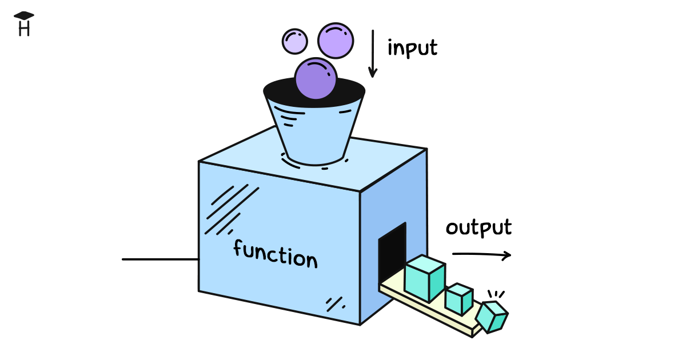

Программирование нужно для того, чтобы выполнять самые разные операции. Иногда это простые действия, например сложение чисел или объединение строк. Но чаще это сложные процессы вроде перевода денег со счета на счет, оформления заказа в интернет-магазине, расчета налогов или подготовки отчета.

Такие операции невозможно выразить одной командой. За действием вроде "перевести деньги" может скрываться десятки, сотни и даже тысячи строк кода. Это проверка баланса, списание суммы, учет комиссии, обновление базы данных, отправка уведомления пользователю.

Чтобы управлять этим кодом и не теряться в деталях, используют функции. Функция объединяет блок кода в единое целое, прячет реализацию и позволяет сосредоточиться на смысле. Для программиста достаточно вызвать функцию и доверить ей всю внутреннюю работу.



Представим функцию, которая переводит деньги с одного счета на другой. В реальности внутри нее может быть сотни строк кода, но мы этого не видим. Снаружи все выглядит как одна простая команда:

```python
transfer_money('Alice', 'Bob', 100)
```

Эта строка вызывает функцию `transfer_money()`. Ей передаются отправитель `Alice`, получатель `Bob` и сумма `100`.

Вот еще несколько примеров вызова функций, которые мы могли бы реализовать. У каждой функции свое имя и свой набор данных для работы.

```python
# Да-да, print тоже функция
print('Хекслет!')

# Отправка письма пользователю
send_email('bob@example.com', 'Добро пожаловать!')

# Вычисление налога с указанной суммы
calculate_tax(5000, 'Florida')

# Проверка, есть ли пользователь в системе
is_registered('Alice')

# Получение случайного числа от 1 до 10
random_number(1, 10)

# Создание резервной копии базы данных
backup_database()

# Вычисление длины строки
let('Hexlet') # Результат: 6
```

В вызове функции сначала пишется ее **имя**, затем круглые **скобки**. Скобки показывают, что это именно вызов. Так мы понимаем, что перед нами функция, а не переменная.

Внутри скобок указываются **аргументы**, то есть данные, которые функция получает для работы. Их может быть несколько, один или вовсе ни одного.

## Откуда берутся функции?

Одни функции встроены в язык (built-in), другие создают сами программисты.

**Встроенные функции** представляют собой функции, которые идут вместе с языком Python. Их можно использовать сразу, без дополнительных действий. В качестве примера можно привести функцию `print()`. Как говорят, она доступна глобально.

**Функции, определяемые программистами**, создаются тогда, когда нужно оформить свою логику в отдельный блок. Такую функцию можно назвать любым именем и использовать в коде так же, как встроенные. Мы научимся этому позже.

Кроме того, существуют функции, которые находятся в отдельных библиотеках. Чтобы ими пользоваться, их нужно подключать с помощью механизма импорта. Подробно импорт мы пока не разбираем. Пока достаточно знать, что он позволяет подключить внешний набор функций и сделать их доступными в программе.

## Функция с одним параметром

Одной из самых часто используемых встроенных функций является `len()`. Для строки она возвращает количество символов.

```python
message = 'Hello!'
count = len(message)
print(count) # => 6
```

Здесь в строке `'Hello!'` шесть символов, поэтому вызов `len(message)` вернет число `6`.

```text
  Аргументы          Функция         Результат
  ┌──────────┐     ┌──────────┐     ┌──────────┐
  │ 'Hello!' │ ──→ │  len()   │ ──→ │    6     │
  └──────────┘     └──────────┘     └──────────┘
```

## Возврат значения

Возврат значения является одним из ключевых принципов работы функций. Благодаря ему мы можем соединять результаты разных действий и строить более сложную логику. Если функция возвращает значение, то мы можем сохранить его в переменную, передать в другую функцию или использовать в вычислениях. Именно так работает `len()`. Она считает количество элементов и отдает результат наружу.

```python
message1 = 'Hello!'
length1 = len(message1) # сохраняем результат

message2 = 'World!'
length2 = len(message2)

combined_length = length1 + length2 # используем результат в выражении
print(combined_length) # 12
```

Если бы `len()` сразу печатала результат на экран (как делает `print()`), то мы бы увидели число, но не смогли бы его использовать:

```python
# воображаемая функция, которая только печатает результат
fake_len('Hello!') # напечатает 6

# но дальше это число уже недоступно
# мы не можем его прибавить, сохранить или сравнить
result = fake_len('Hello!') # здесь в result ничего нет
```

Вот почему возврат значения представляет собой настолько важную концепцию. Он позволяет связывать функции между собой. Одни возвращают данные, другие используют их в своей работе. Именно так из маленьких шагов строятся большие и сложные программы.

## Функция с несколькими параметрами

Некоторые функции принимают сразу несколько данных для работы. В качестве примера подойдет встроенная функция `pow()`, которая возводит число в нужную степень. Первый параметр принимает основание степени, второй задает показатель.

```python
# 2 возводим в 3-ю степень: 2 * 2 * 2
result = pow(2, 3)
print(result) # => 8

# 5 во 2-й степени: 5 * 5
print(pow(5, 2)) # => 25
```

По структуре вызов с несколькими параметрами не отличается от вызова с одним. Те же имя функции, скобки и аргументы через запятую внутри.

## Параметры и аргументы

В разговорах о функциях то и дело встречаются слова **параметры** и **аргументы**. Они связаны, но не одно и то же.

О **параметрах** говорят при создании функции. Параметром называют переменную внутри функции, в которую попадает переданное значение. Об **аргументах** говорят при вызове. Аргументом называют то, что мы передаем в функцию. Это может быть число, переменная или любое выражение.

```python
# числа в качестве аргументов
print(pow(2, 3)) # => 8

x = 2
# аргумент может быть выражением, оно вычислится до передачи в функцию
print(pow(x + 1, 3)) # => 27
```

Запоминать это не обязательно, но пригодится при чтении англоязычной литературы.
