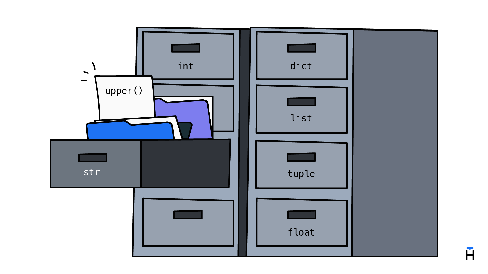

Python admite la programación orientada a objetos (POO): de forma muy simplificada, es un enfoque en el que operamos no con datos y funciones, sino con objetos y métodos. No pensamos detenernos en detalle en este tema en este curso, porque es amplio y su comprensión requiere cierto nivel de preparación. Ignorarlo por completo es imposible, porque los objetos aparecen literalmente de inmediato, en cuanto empezamos a escribir código en Python. Por eso tocaremos este tema, pero solo en la medida necesaria para las tareas actuales.



Hasta este momento trabajábamos en el código con datos y les aplicábamos funciones. En la POO, en lugar de datos tenemos objetos sobre los que se llaman métodos. Por ejemplo, las cadenas en Python son objetos y tienen un método `upper()`, que convierte todas las letras a mayúsculas.

```python
text = "hexlet"
print(text.upper())  # => HEXLET
```

A diferencia de las funciones, los métodos se llaman *sobre un objeto*. Primero se escribe el objeto y luego, después de un punto, la llamada al método. A pesar de que el método `upper()` no recibe argumentos, por dentro sabe sobre qué objeto se lo llama y tiene acceso al objeto mismo.

Surge entonces la pregunta lógica: ¿por qué `len()` está implementada como una función normal y no como un método `str.len()`? Ocurre que `len()` no trabaja solo con cadenas: es una función universal que se puede aplicar a multitud de objetos distintos. A usar objetos y a crear tipos de objetos propios aprendemos en los cursos avanzados de Hexlet.

Las cadenas tienen bastantes métodos incorporados; estos son algunos de ellos.

```python
# Convertir la primera letra a mayúscula
print("hexlet".capitalize())  # => Hexlet

# Convertir todas las letras a minúsculas
print("HeXleT".lower())  # => hexlet

# Eliminar los espacios al principio y al final de la cadena
print("   hi   ".strip())  # => hi
```

Algunos métodos reciben parámetros. Por ejemplo, en el método `replace()` el primer parámetro contiene la subcadena que hay que reemplazar y el segundo contiene la cadena de reemplazo.

```python
text = "abracadabra"

print(text.replace("a", "o"))  # => obrocodobro
print(text.replace("abra", "!"))  # => !cad!
```

En Python hay realmente muchos métodos, y no se aprenden de memoria. Normalmente los programadores, en el transcurso del trabajo, recuerdan qué operaciones necesitan en general y cómo se llaman aproximadamente esos métodos. Cuando surge una tarea, o recuerdan el método adecuado, o lo encuentran rápido en la documentación.

## Método y función: comparación

Desde el punto de vista del código, los métodos y las funciones se comportan de forma parecida. Reciben valores y devuelven un resultado. Se diferencian solo en la **sintaxis** de la llamada.

```python
# Llamada a una función
len("hexlet")

# Llamada a un método
"hexlet".upper()
```

La función se llama desde fuera y recibe el argumento entre paréntesis. El método es una operación incorporada en el valor mismo. Por debajo el valor se pasa hacia dentro como parámetro cero, pero eso queda oculto para nosotros.

```text
Función:   len('hexlet')         →  6
                └── argumento

Método:    'hexlet'.upper()      →  'HEXLET'
            └── objeto  └── método
```

## Los métodos devuelven valores

Igual que las funciones, los métodos **devuelven un resultado**. Se pueden usar como parte de expresiones.

```python
name = "hexlet"
print(name.upper() + "!")  # => HEXLET!
```

Los métodos de las cadenas siempre devuelven una cadena nueva y dejan la original sin cambios. Ese comportamiento se llama inmutabilidad. Todavía hablaremos de ello más adelante, pero por ahora es importante entender que la cadena queda igual y que el resultado del método es un valor nuevo.

```python
name = "hexlet"
print(name.upper())  # => HEXLET
print(name)  # => hexlet
```

## Para qué hacen falta los métodos en Python

En Python, parte de las posibilidades está implementada precisamente como métodos. Eso permite agrupar las operaciones junto a los tipos de datos a los que se refieren. Las cadenas tienen un conjunto de métodos, los números otro y las listas un tercero. Así, en el lenguaje coexisten dos formas de trabajo. Las funciones de propósito general se aplican a cualesquiera datos, y los métodos están "adheridos" a tipos concretos.

Si miramos la POO en su conjunto, aporta algo llamado polimorfismo de subtipos (subtyping), que en este curso no se analiza.
