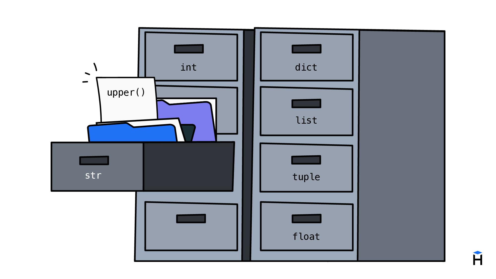

Python поддерживает объектно-ориентированное программирование (ООП), это, очень упрощенно, подход, при котором мы оперируем не данными и функциями, а объектами и методами. Мы не планируем подробно останавливаться на этом в данном курсе, потому что эта тема объемная и для понимания требует определенного уровня подготовки. Совсем ее игнорировать невозможно, потому что объекты появляются буквально сразу, как только мы начинаем писать код на Python. Поэтому мы коснемся этой темы, но только на том уровне, на котором это нужно для текущих задач.



До этого момента мы работали в коде с данными и применяли к ним функции. В ООП у нас вместо данных объекты, на которых вызываются методы. Например, строки в Python являются объектами и у них есть метод `upper()` который переводит все буквы в верхний регистр.

```python
text = 'hexlet'
print(text.upper())  # => HEXLET
```

В отличие от функций, методы вызываются *на объекте*. Сначала записывается объект, затем, через точку вызов метода. Несмотря на то, что метод `upper()` не принимает аргументов, он, внутри себя знает про то на каком объекте вызывается и у него есть доступ к самому объекту. 

Тогда закономерный вопрос, почему `len()` реализована как обычная функция, а не как метод `str.len()`? Дело в том, что `len()` работает не только со строками, это универсальная функция, которая может применяться ко множеству разных объектов. Пользоваться объектами и создавать собственные типы объектов мы учимся в продвинутых курсах на Хекслете.

Встроенных методов у строк довольно много, вот некоторые из них.

```python
# Перевод первой буквы в верхний регистр
print('hexlet'.capitalize())  # => Hexlet

# Перевод всех букв в нижний регистр
print('HeXleT'.lower())  # => hexlet

# Удаление пробелов в начале и конце строки
print('   hi   '.strip())  # => hi
```

Некоторые методы принимают параметры. Например, у метода `replace()` первый параметр содержит подстроку, которую нужно заменить, а второй содержит строку-замену.

```python
text = 'abracadabra'

print(text.replace('a', 'o'))   # => obrocodobro
print(text.replace('abra', '!'))  # => !cad!
```

Методов в Python действительно много, и их не учат наизусть. Обычно программисты в процессе работы запоминают, какие операции им вообще нужны и как примерно называются такие методы. При возникновении задачи они либо вспоминают подходящий метод, либо быстро находят его в документации.

## Метод и функция: сравнение

С точки зрения кода, методы и функции ведут себя похоже. Они принимают значения и возвращают результат. Отличаются только **синтаксисом** вызова.

```python
# Вызов функции
len('hexlet')

# Вызов метода
'hexlet'.upper()
```

Функция вызывается снаружи и получает аргумент в скобках. Метод представляет собой операцию, встроенную в само значение. Под капотом значение передается внутрь как нулевой параметр, но это скрыто от нас.

```text
  Функция:   len('hexlet')         →  6
                  └── аргумент

  Метод:     'hexlet'.upper()      →  'HEXLET'
              └── объект  └── метод
```

## Методы возвращают значения

Как и функции, методы **возвращают результат**. Их можно использовать в составе выражений.

```python
name = 'hexlet'
print(name.upper() + '!') # => HEXLET!
```

Методы строк всегда возвращают новую строку, оставляя исходную без изменений. Это поведение называется иммутабельностью. Мы еще поговорим об этом позже, но пока важно понимать, что строка остается прежней, а результат метода является новым значением.

```python
name = 'hexlet'
print(hexlet.upper()) # => HEXLET
print(hexlet)         # => hexlet
```

## Зачем нужны методы в Python

В Python часть возможностей реализована именно как методы. Это позволяет сгруппировать операции рядом с типами данных, к которым они относятся. У строк есть один набор методов, у чисел другой, у списков третий. Таким образом, в языке сосуществуют два способа работы. Функции общего назначения применяются к любым данным, а методы "прикреплены" к конкретным типам.

Если смотреть на ООП в целом, то оно дает такую вещь как полиморфизм подтипов (subtyping), который в этом курсе не разбирается.
