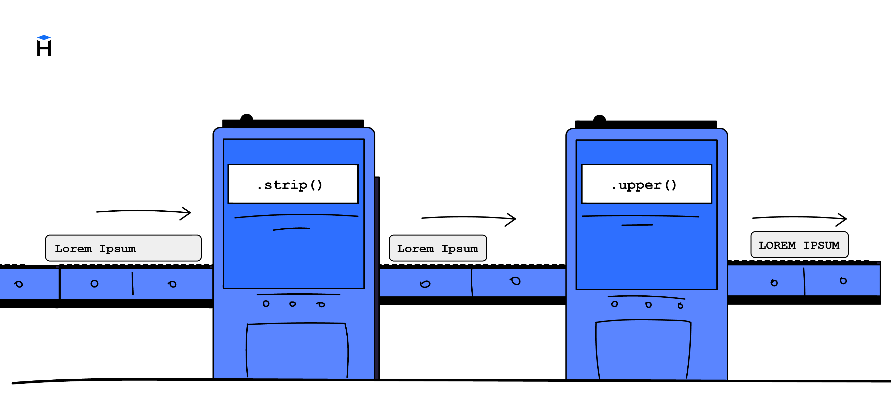

Un método es una operación que se aplica a un valor y devuelve un resultado nuevo. Si el resultado permite de nuevo llamar a métodos, se le puede aplicar otro método más. Esa técnica se llama **cadena de métodos (method chaining)**.

```python
text = "  hExLeT  "
result = text.strip().lower()
print(result)  # => 'hexlet'
```

1. El método `strip()` elimina los espacios al principio y al final de la cadena y devuelve `'hExLeT'`.
2. El método `lower()` pone todas las letras en minúscula y devuelve `'hexlet'`.



Los métodos se llaman uno tras otro, como eslabones de una cadena. Eso permite escribir código compacto y legible.

```python
print("  hExLeT  ".strip().lower().replace("h", "x"))  # => xexlet

# Lo mismo, pero sin cadena
text = "  hExLeT  "
step1 = text.strip()  # 'hExLeT'
step2 = step1.lower()  # 'hexlet'
step3 = step2.replace("h", "x")  # 'xexlet'
print(step3)
```

- `strip()` elimina los espacios.
- `lower()` pone las letras en minúscula.
- `replace('h', 'x')` cambia `h` por `x`.

Cada método devuelve una cadena nueva, y el método siguiente se aplica ya a esa cadena.

```text
' Hello, World! '.strip().lower().replace('world', 'python')
                  │        │           │
                  ↓        ↓           ↓
           'Hello, World!' │           │
                  'hello, world!'      │
                           'hello, python!'
```

## Orden de evaluación

En una cadena de métodos el orden de ejecución va de izquierda a derecha. Cada método siguiente se llama sobre el resultado del anterior.

```python
print("  hExLeT  ".strip().lower().replace("h", "x"))  # => xexlet
```

1. `'  hExLeT  '` es la cadena de partida.
2. `.strip()` elimina los espacios y devuelve `'hExLeT'`.
3. `.lower()` pasa a minúsculas y devuelve `'hexlet'`.
4. `.replace('h', 'x')` reemplaza `'h'` por `'x'` y devuelve `'xexlet'`.

Al usar funciones, la parte interna se ejecuta primero y su resultado se pasa a la función siguiente.

```python
# Ejemplo hipotético, si strip y lower fueran funciones
print(lower(strip("  hExLeT  ")))
```

Con los métodos simplemente te "mueves" de izquierda a derecha, leyendo la cadena como una frase normal. Eso hace que trabajar con métodos resulte especialmente cómodo.

Si se confunde el orden, el resultado puede diferir:

```python
print("  hExLeT  ".replace("h", "x").strip().lower())  # => xexlet
```

En este caso `replace()` actuará sobre la cadena con espacios. El resultado final salió igual, pero eso es más bien una coincidencia. En otras situaciones el orden sí importa.

## Cadena después de un corte

Los métodos se pueden llamar también después de otras operaciones, por ejemplo después de un corte de la cadena:

```python
text = "  Hello, Hexlet!  "
# Eliminamos los espacios, tomamos la subcadena y pasamos a minúsculas
print(text.strip()[7:].lower())  # => hexlet!
```

Aquí se llama primero a `strip()`, que elimina los espacios. Después tomamos el corte de la cadena `[7:]`, empezando por el octavo carácter. Y ya después de eso se llama a `lower()`, para pasar el resultado a minúsculas.

Esa forma de escribir se lee de izquierda a derecha y muestra todo el recorrido de transformación de los datos en una sola línea.

## Dónde termina la cadena

La cadena se puede continuar mientras el resultado siga siendo una cadena de texto (u otro tipo que tenga métodos). Si un método devuelve un número u otro tipo simple, ya no se pueden llamar métodos más adelante:

```python
text = "hexlet"
length = text.upper().count("E")
print(length)  # => 2
```

El método `count()` devuelve el número `2`, y ese número ya no tiene métodos de cadena, por eso la cadena de métodos termina ahí.

Las cadenas de métodos son una forma cómoda de unir varias operaciones sobre un valor sin variables intermedias.
