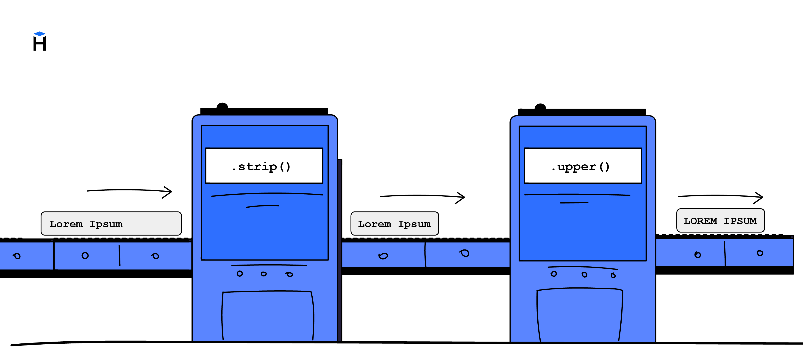

Метод — это операция, которая применяется к значению и возвращает новый результат. Если результат снова позволяет вызывать методы, то к нему можно применить ещё один метод. Такой приём называется **цепочка методов (method chaining)**.

Вот пример:

```python
text = '  hExLeT  '
result = text.strip().lower()
print(result)  # => hexlet
```

Здесь происходит следующее:

1. Метод `strip()` удаляет пробелы в начале и конце строки. Результат — `'hExLeT'`.
2. Метод `lower()` делает все буквы строчными. Результат — `'hexlet'`.

Методы вызываются один за другим, как звенья в цепочке. Это позволяет писать компактный и читаемый код.

```python
print('  hExLeT  '.strip().lower().replace('h', 'x'))  # => xexlet

# То же самое, но без цепочки
text = '  hExLeT  '
step1 = text.strip()             # 'hExLeT'
step2 = step1.lower()            # 'hexlet'
step3 = step2.replace('h', 'x')  # 'xexlet'
print(step3)
```

В этом примере:

- `strip()` удаляет пробелы
- `lower()` делает буквы строчными
- `replace('h', 'x')` меняет `h` на `x`

Каждый метод возвращает новую строку, и следующий метод применяется уже к этой строке.

## Порядок вычисления

В цепочке методов порядок выполнения идёт слева направо. Каждый следующий метод вызывается на результате предыдущего:

```python
print('  hExLeT  '.strip().lower().replace('h', 'x'))  # => xexlet
```

Что происходит шаг за шагом:

1. `'  hExLeT  '` — исходная строка.
2. `.strip()` удаляет пробелы в начале и конце: `'hExLeT'`.
3. `.lower()` приводит строку к нижнему регистру: `'hexlet'`.
4. `.replace('h', 'x')` заменяет `'h'` на `'x'`: `'xexlet'`.

В отличие от функций, где внутренняя часть выполняется первой, а затем её результат передаётся в следующую функцию:

```python
 # Условный пример, если бы strip и lower были функциями
print(lower(strip('  hExLeT  ')))
```

В методах вы просто «двигаетесь» слева направо, читая цепочку как обычное предложение. Это делает работу с методами особенно удобной.

Если перепутать порядок, результат может отличаться:

```python
print('  hExLeT  '.replace('h', 'x').strip().lower())  # => xexlet
```

В этом случае `replace()` сработает на строку с пробелами. Итог оказался тем же, но это скорее совпадение. В других ситуациях порядок действительно имеет значение.

## Цепочка после среза

Методы можно вызывать и после других операций, например, после среза строки:

```python
text = '  Hello, Hexlet!  '
# Удаляем пробелы, берём подстроку и переводим в нижний регистр
print(text.strip()[7:].lower())  # => hexlet!
```

Здесь сначала вызывается `strip()`, который удаляет пробелы. Затем мы берём срез строки `[7:]`, начиная с восьмого символа. И уже после этого вызывается `lower()`, чтобы привести результат к нижнему регистру.

Такая запись читается слева направо и показывает весь путь преобразования данных в одной строке.

## Где цепочка заканчивается

Цепочку можно продолжать, пока результат остаётся строкой (или другим типом, у которого есть методы). Если метод возвращает число или другой простой тип, то дальнейшие методы вызывать уже нельзя:

```python
text = 'hexlet'
length = text.upper().count('E')
print(length)  # => 1
```

Метод `count()` возвращает число `1`, и это число уже не имеет строковых методов, поэтому цепочка на этом заканчивается.

Цепочки методов — не обязательный, но удобный способ объединять несколько операций над значением без промежуточных переменных.
