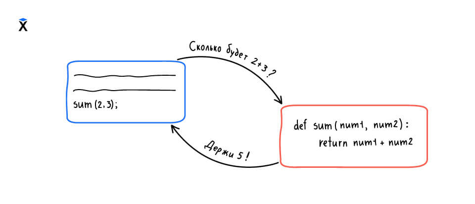

В этом уроке мы научимся писать функции, которые **возвращают значения**. Такие функции не просто что-то делают, а отвечают на вопрос и отдают результат своей работы — как будто говорят: «Вот, держи, я посчитала».

Например, функция может вернуть строку с обработанным текстом или число, вычисленное по формуле. Возвращённое значение можно использовать дальше — сохранить в переменную, передать в другую функцию или вывести на экран.

Чтобы функция отдала результат, в ней используется специальное ключевое слово — `return`. Оно завершает выполнение функции и указывает, что именно нужно вернуть.

Вот пример функции, которая делает текст заглавным:

```python
def shout(name):
    return name.upper()
```

Мы вызываем `shout()`, передаём туда имя, и получаем строку в верхнем регистре. Эта строка — результат функции:

```python
result = shout('hexlet')
print(result)  # => HEXLET

result2 = shout('code-basics')
print(result2)  # => CODE-BASICS
```

В отличие от `print()`, `return` ничего не печатает. Оно просто возвращает значение. Что с ним делать — решает вызывающий код.

**Как это работает:**

При вызове функции `shout('hexlet')` сначала выполняется выражение `name.upper()`. Оно возвращает строку `'HEXLET'`. Затем `return` отдаёт это значение наружу — туда, откуда была вызвана функция. В нашем случае это значение сохраняется в переменную `result`, а потом выводится на экран через `print()`.

## Возврат вычисленного выражения

Функции не обязаны просто возвращать параметр. Обычно в `return` указывается **выражение**, которое сначала вычисляется, а потом результат передаётся наружу.

```python
def full_name(first, last):
    return first.capitalize() + ' ' + last.capitalize()
```

В этом примере мы собираем полное имя из имени и фамилии. Сначала вызываются методы `capitalize()`, затем строки объединяются через `+`, и уже готовая строка возвращается.

```python
name = full_name('Aria', 'Stark')
print(name)  # => Aria Stark
```

Здесь в строке `return first.capitalize() + ' ' + last.capitalize()` сначала выполняются оба вызова методов, потом прибавляется пробел, и только затем результат передаётся как возвращаемое значение.

## Многострочные функции

Иногда в теле функции нужно сделать несколько шагов, прежде чем получить результат. В таких случаях пишут несколько строк кода, а в конце используют `return`, чтобы вернуть итоговое значение.

Например, напишем функцию, которая форматирует имя: удаляет пробелы по краям и переводит все буквы в верхний регистр.

```python
def format_name(name):
    clean = name.strip()
    uppercased = clean.upper()
    return uppercased
```

Здесь по шагам:

1. Убираем пробелы с помощью метода `strip()`
2. Переводим в верхний регистр с помощью `upper()`
3. Возвращаем итоговое значение

Пример использования:

```python
print(format_name('  hexlet  '))  # => HEXLET
```

### Код после `return`

Когда Python доходит до оператора `return`, выполнение функции останавливается. Всё, что написано после него внутри функции, **не будет выполнено**:

```python
def example():
    return 'готово'
    print('этот код никогда не выполнится')
```

Поэтому `return` всегда пишут в конце логики. Однако таких концов внутри функции может быть много, подробнее мы этого коснемся, когда доберемся до условных выражений
