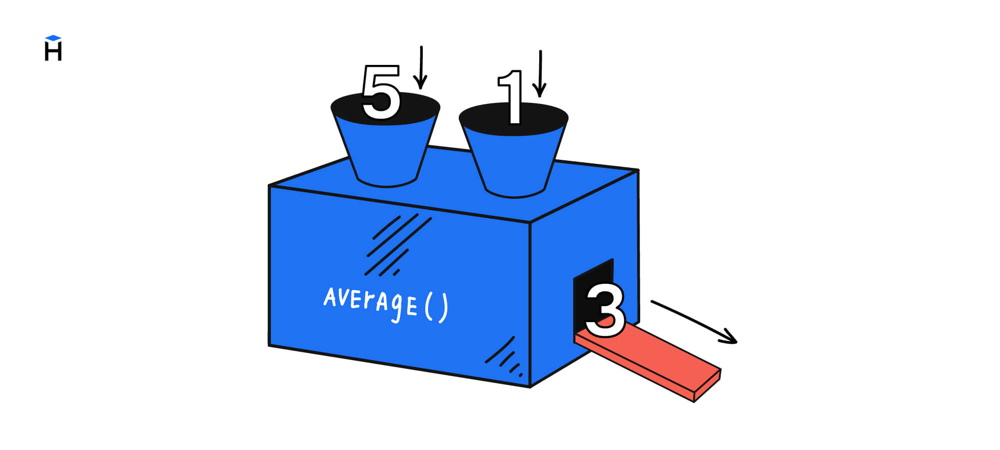

Функции могут не только возвращать значения, но и принимать данные - аргументы. В этом уроке мы научимся создавать такие функции.

Напомним, что с аргументами функций мы уже сталкивались:

```python
# Принимает на вход один аргумент любого типа
print('я аргумент')
# Принимает на вход два строковых аргумента
# первый — что ищем, второй — на что меняем
'google'.replace('go', 'mo')  # moogle
# Принимает на вход два числовых аргумента
# первый — округляемое число, второй — число знаков после запятой, которые нужно оставить
round(10.23456, 3)  # 10.235
```

А теперь представим, что нам нужно реализовать функцию `get_last_char()`, которая возвращает последний символ в строке, переданной ей на вход.

Вот как будет выглядеть использование этой функции:

```python
# Передача аргументов напрямую без переменных
get_last_char('Hexlet')  # t
# Передача аргументов через переменные
name1 = 'Hexlet'
get_last_char(name1)  # t
name2 = 'Goo'
get_last_char(name2)  # o
```

Из этого примера можно сделать следующие выводы:

* Нам нужно определить функцию `get_last_char()`
* Функция должна принимать на вход один аргумент строкового типа
* Функция должна возвращать значение строкового типа

Определяем функцию:

```python
def get_last_char(text):
    return text[-1]
```

В скобках указывается имя переменной `text`, которая служит **параметром**. Имя параметра может быть любым, это просто переменная, что будет использоваться внутри функции. Главное, чтобы оно отражало смысл значения, которое содержится внутри. Например:

```python
def get_last_char(string):
    return string[-1]
```

Значение, подставленное на место параметра, будет зависеть от вызова этой функции:

```python
# Внутри функции переменная string будет равна 'hexlet'
print(get_last_char('hexlet')) # => t

# Внутри функции переменная string будет равна 'code'
print(get_last_char('code')) # => e

# Внутри функции переменная string будет равна 'Winter is coming'
# Имя переменной снаружи не связано с именем переменной в определении функции
text = 'Winter is coming'
print(get_last_char(text))  # => g
```

Аргумент нужно обязательно передавать. Если вызвать функцию без него, то интерпретатор выдаст ошибку:

```python
get_last_char()  # У такого кода нет смысла

TypeError: get_last_char() missing 1 required positional argument: 'string'
```

Полный пример:

```python
# определяем функцию
def get_last_char(string):
    return string[-1]


# Печатаем результат
print(get_last_char('hexlet')) # => t
```

Многие функции работают одновременно с несколькими аргументами. Например, чтобы округлить число, нужно указать не только само число, но и количество знаков после запятой:

```python
round(10.23456, 3)  # 10.235
```

То же самое относится и к методам. Они могут требовать на вход любое количество аргументов, которое им нужно для работы:

```python
# Первый параметр — что ищем
# Второй параметр — на что меняем
print('google'.replace('go', 'mo') ) # => moogle
```

Чтобы создать такие функции и методы, в определении нужно указать необходимое количество параметров через запятую. Еще им нужно дать понятные имена.

Ниже пример определения функции `replace()`, которая заменяет в слове одну часть строки на другую:

```python
def replace(text, from_, to):
    # Здесь тело функции,
    # но мы его убираем, чтобы не отвлекаться


print(replace('google', 'go', 'mo'))  # => moogle
```

Когда параметров два и более, то важен порядок, в котором будут передаваться аргументы. Если его поменять, то функция отработает по-другому:

```python
# Ничего не заменилось,
# так как внутри google нет mo
print(replace('google', 'mo', 'go'))  # => google
```

Теперь вы знаете, как создавать функции, которые могут принимать на вход аргументы.
