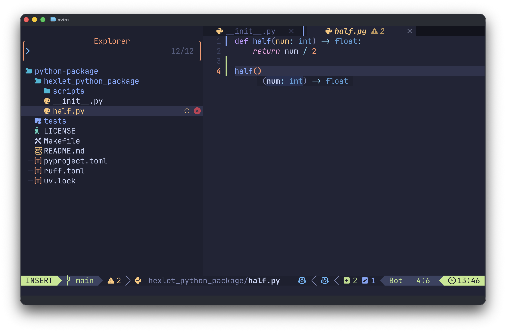
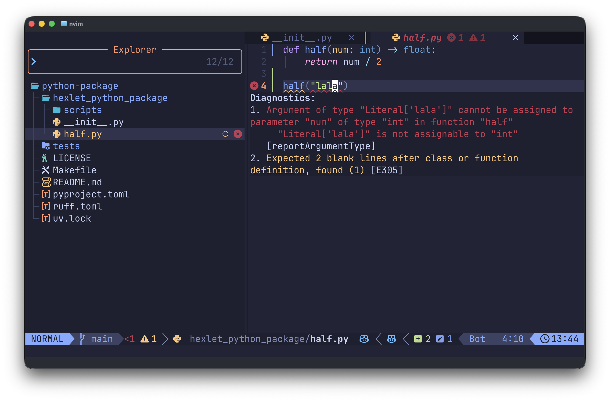

En Python se pueden pasar a una función cualesquiera valores. A veces eso complica la comprensión del código: no siempre queda claro qué espera exactamente la función y qué devuelve. Para hacer el código más claro, en Python existen las **anotaciones de tipos**. Con su ayuda se puede indicar explícitamente qué valores recibe la función y qué resultado devuelve. Así resolvemos varias tareas a la vez:

- Mejoramos el trabajo del editor de código: obtenemos sugerencias, un autocompletado mejor y cosas por el estilo.
- Ayudamos a los agentes de IA a ver más rápido la estructura y a tomar decisiones más correctas, minimizando errores accidentales.
- Aparece la posibilidad de comprobar la corrección del programa sin ejecutarlo, mediante la comprobación estática. Esa comprobación no garantiza que la lógica del programa esté escrita correctamente, pero al menos no habrá en él errores de tipos.



## Cómo indicar los tipos de los parámetros

La anotación de una función describe dos elementos. Los tipos de los parámetros se indican directamente en la definición de la función, después del nombre de cada parámetro y separados por dos puntos. El tipo del resultado devuelto se indica después de la lista de parámetros con la flecha `->`.

Analicémoslo con el ejemplo de una función que calcula la suma de dos valores pasados:

```python
def add(a: int, b: int) -> int:
    return a + b


print(add(2, 3))  # => 5
```

```text
def concat(a: str, b: str) -> str:
            │       │         │
            │       │         └── tipo del valor devuelto
            │       └── tipo del parámetro b
            └── tipo del parámetro a
```

Ahora el editor de código sugerirá que la función `add` recibe dos números y devuelve un número. Si se intenta pasar una cadena, el editor lo resaltará como un problema y avisará.

```python
add("2", 3)  # Argument of type "str" is not assignable to parameter of type "int"
```

## Qué tipos se usan en las anotaciones

En esta etapa basta con conocer las anotaciones de los tipos de datos simples, primitivos:

- `int` para los números enteros, `float` para los números de coma flotante
- `str` para las cadenas
- `bool` para los valores lógicos (True o False)

```python
def describe(name: str, age: int, height: float) -> str:
    return f"{name}, {age} años, altura {height}"


print(describe("Anna", 25, 1.70))
# => Anna, 25 años, altura 1.7
```

Si la función no devuelve nada, como tipo de retorno se indica `None`. Por ejemplo, una función puede solo imprimir texto en pantalla:

```python
def print_greeting(name: str) -> None:
    print(f"Hello, {name}!")


print_greeting("Anna")
# => Hello, Anna!
```

## Ejemplo con parámetros por defecto

Las anotaciones funcionan igual tanto para los parámetros obligatorios como para los que tienen un valor por defecto. Primero se indica el tipo y luego, con `=`, el valor estándar.

```python
def greet(name: str, greeting: str = "Hello") -> str:
    return f"{greeting}, {name}"


print(greet("Anna"))  # => Hello, Anna
print(greet("Kirill", "Hi"))  # => Hi, Kirill
```

En este ejemplo `name` es un parámetro obligatorio y `greeting` tiene un valor por defecto. Las anotaciones muestran los tipos de los dos parámetros y del resultado devuelto.

## Las anotaciones y la comprobación del código

Aunque Python en sí no comprueba las anotaciones durante la ejecución del programa, existen herramientas aparte que saben hacerlo y normalmente vienen incorporadas directamente en el editor. Ese enfoque se llama **comprobación estática del código**, es decir, una comprobación realizada sin ejecutar el código.

"Estática" significa que la comprobación ocurre antes incluso de arrancar el programa. La herramienta lee el código fuente y verifica si los valores pasados corresponden a los tipos indicados. Por ejemplo, si la función recibe una cadena y tú le pasas un número, en la comprobación estática eso se mostrará como un error.



Resulta especialmente cómodo cuando el editor resalta esos errores justo mientras se escribe el código. Eso permite ver el problema de inmediato y corregirlo, sin esperar a ejecutar el programa. Gracias a ello muchos errores inesperados se detectan por adelantado y en el código en funcionamiento son menos.

Las anotaciones de tipos no son obligatorias. Las funciones se pueden escribir también sin ellas: Python funcionará igualmente. Pero cuando hay anotaciones, el código se vuelve más claro para las personas y más cómodo para los editores. Anotar las funciones en tu propio código se considera una buena práctica.
