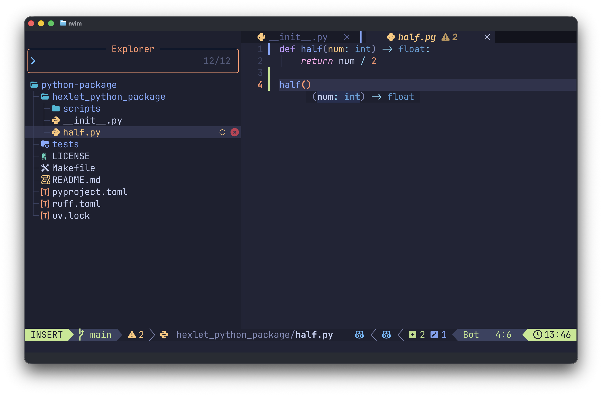
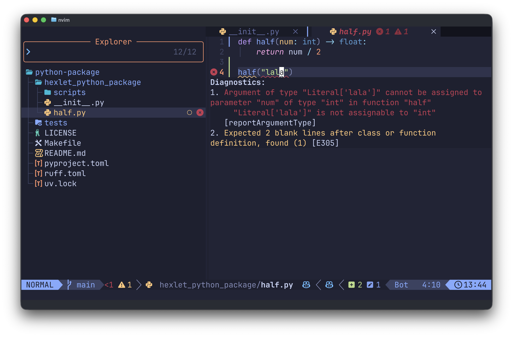

В Python в функцию можно передать любые значения. Иногда это усложняет понимание кода: не всегда ясно, что именно ожидает функция и что она возвращает. Чтобы сделать код понятнее, в Python есть **аннотации типов**. С их помощью можно явно указать, какие значения принимает функция и какой результат она возвращает. Таким образом мы решаем сразу несколько задач:

- Улучшаем работу редактора кода, получаем подсказки, лучше автодополнение и тому подобное.
- Помогаем ИИ агентам быстрее видеть структуру и принимать более правильные решения минимизируя случайные ошибки.
- Появляется возможность проверять корректность программы без ее запуска, за счет статической проверки. Такая проверка не гарантирует, что логика программы написана правильно, но, по крайней мере, в ней не будет ошибок типов.



## Как указывать типы параметров

Аннотация функции описывает два элемента. Типы параметров указываются прямо в определении функции после имени каждого параметра через двоеточие. Тип возвращаемого результата указывается после списка параметров с помощью стрелки `->`.

Разберем на примере функции, которая вычисляет сумму двух переданных значений:

```python
def add(a: int, b: int) -> int:
    return a + b

print(add(2, 3))   # => 5
```

```text
def concat(a: str, b: str) -> str:
            │       │         │
            │       │         └── тип возвращаемого значения
            │       └── тип параметра b
            └── тип параметра a
```

Теперь редактор кода будет подсказывать, что функция `add` принимает два числа и возвращает число. Если попытаться передать строку, редактор подсветит это как проблему и предупредит.

```python
add("2", 3)  # Argument of type "str" is not assignable to parameter of type "int"
```

## Какие типы используются в аннотациях

На этом этапе достаточно знать аннотации для простых, примитивных типов данных:

- `int` для целых чисел, `float` для чисел с плавающей точкой
- `str` для строк
- `bool` для логических значений (True или False)

```python
def describe(name: str, age: int, height: float) -> str:
    return f"{name}, {age} лет, рост {height}"

print(describe("Anna", 25, 1.70))
# => Anna, 25 лет, рост 1.7
```

Если функция ничего не возвращает, то в качестве возвращаемого типа указывается `None`. Например, функция может только печатать текст на экран:

```python
def print_greeting(name: str) -> None:
    print(f"Hello, {name}!")

print_greeting("Anna")
# => Hello, Anna!
```

## Пример с параметрами по умолчанию

Аннотации работают одинаково как для обязательных параметров, так и для тех, у которых есть значение по умолчанию. Сначала указывается тип, потом через `=` указывается стандартное значение.

```python
def greet(name: str, greeting: str = "Hello") -> str:
    return f"{greeting}, {name}"

print(greet("Anna"))          # => Hello, Anna
print(greet("Kirill", "Hi"))  # => Hi, Kirill
```

В этом примере `name` является обязательным параметром, а `greeting` имеет значение по умолчанию. Аннотации показывают типы обоих параметров и возвращаемого результата.

## Аннотации и проверка кода

Хотя сам Python не проверяет аннотации во время выполнения программы, есть отдельные инструменты, которые умеют это делать и, обычно, они встроены прямо в редактор. Такой подход называют **статической проверкой кода**, то есть проверкой выполняемой без запуска кода.

"Статическая" значит, что проверка происходит еще до запуска программы. Инструмент читает исходный код и сверяет, соответствуют ли переданные значения указанным типам. Например, если функция принимает строку, а вы передадите число, то при статической проверке это будет показано как ошибка.



Особенно удобно, когда такие ошибки подсвечивает редактор прямо во время написания кода. Это позволяет сразу увидеть проблему и исправить ее, не дожидаясь запуска программы. Благодаря этому многие неожиданные ошибки отлавливаются заранее и в работающем коде их становится меньше.

Аннотации типов не являются обязательными. Функции можно писать и без них, Python все равно будет работать. Но когда аннотации есть, код становится понятнее для людей и удобнее для редакторов. Аннотирование функций в своем коде считается хорошей практикой.
