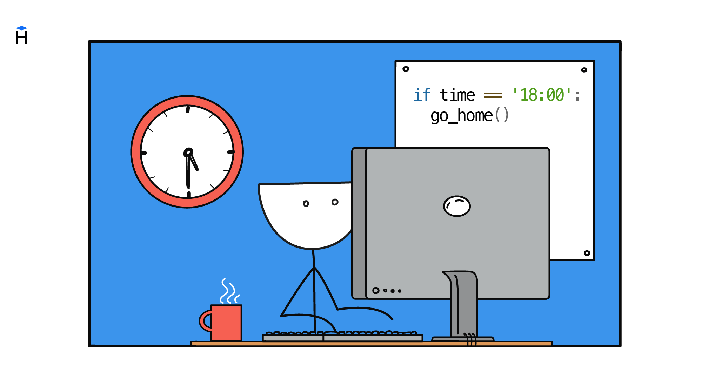

Las expresiones lógicas permiten comprobar distintas condiciones. Pero por sí solas únicamente devuelven `True` o `False`. Para que el programa pueda ejecutar acciones distintas según el resultado, en Python existe la construcción especial `if`.



```python
if 5 > 3:
    print("Yes, it is true")
```

Aquí la cadena `"Yes, it is true"` se imprimirá, porque la condición `5 > 3` es verdadera.

```text
┌───────────┐
│ ¿condición?│
└─────┬─────┘
  True │
      ↓
┌───────────┐
│ cuerpo if │
└───────────┘
```

## Las sangrías en los bloques

Después de la palabra `if` se escribe la condición, luego se ponen dos puntos y empieza el bloque de código con sangría. Todas las líneas con la misma sangría forman parte de un mismo bloque.

```python
if 10 == 10:
    print("First")
    print("Second")

print("Goodbye!")
```

Aquí se imprimirán `"First"` y `"Second"`, porque la condición se cumplió. Y `"Goodbye!"` se imprimirá en cualquier caso, ya que está fuera de los límites del bloque. El principio es el mismo que en la definición de funciones.

## Uso de if dentro de una función

Veamos una función que determina el tipo de la oración recibida. Si termina en un signo de interrogación, la función devolverá `"question"`; en caso contrario devolverá `"normal"`.

```python
def get_type_of_sentence(sentence: str) -> str:
    last_char = sentence[-1]
    if last_char == "?":
        return "question"
    return "normal"


print(get_type_of_sentence("Hodor"))  # => normal
print(get_type_of_sentence("Hodor?"))  # => question
```

Aquí se usan a la vez dos `return`. Si la condición dentro del `if` se cumple, actúa `return 'question'` y la función termina. Si la condición no se cumple, el control pasa a la línea siguiente con `return 'normal'`.

Así pues, la función tiene varios puntos de salida posibles. Es una práctica frecuente. Según las condiciones, la función puede terminar de distintas maneras.

A pesar de que la función `get_type_of_sentence` usa `if`, devuelve cadenas, y eso significa que no es un predicado. Como predicado veamos una función que comprueba si hay suficiente dinero para la compra.

```python
def has_enough_money(balance: int, price: int) -> bool:
    if balance >= price:
        return True
    return False


print(has_enough_money(100, 50))  # => True
print(has_enough_money(30, 50))  # => False
```

## if y las expresiones lógicas

La función `has_enough_money` la escribimos con `if`. Pero en esa forma podría prescindir de él, porque el resultado de la comparación es ya por sí mismo una expresión lógica.

```python
def has_enough_money(balance: int, price: int) -> bool:
    return balance >= price
```

En los casos simples es mejor devolver esa expresión de inmediato. El `if` hace falta allí donde dentro del bloque se ejecutan acciones adicionales además de devolver el resultado. Cuanto más complejos sean los programas que escribamos, más a menudo empezarán a aparecer esas situaciones.
