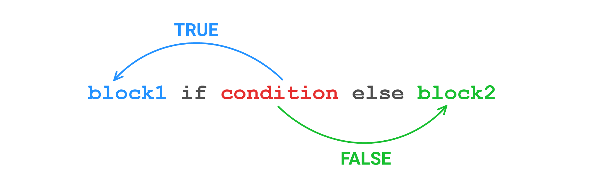

Mira la definición de la función que devuelve el valor absoluto del número recibido:

```python
# El valor absoluto es el número mismo sin el signo
def abs(number: int) -> int:
    if number >= 0:
        return number
    return -number
```

Pero se puede escribir de forma más concisa. En Python hay una construcción que funciona como `if-else`. Se llama **operador ternario** y es el único operador de Python que exige tres operandos:

```python
def abs(number: int) -> int:
    return number if number >= 0 else -number
```

El patrón general se ve así: `<expression on true> if <predicate> else <expression on false>`.



Reescribamos la variante inicial de `get_type_of_sentence()` de forma análoga.

Antes:

```python
def get_type_of_sentence(sentence: str) -> str:
    last_char = sentence[-1]
    if last_char == '?':
        return 'question'
    return 'normal'
```

Después:

```python
def get_type_of_sentence(sentence: str) -> str:
    last_char = sentence[-1]
    return 'question' if last_char == '?' else 'normal'

print(get_type_of_sentence('Hodor'))   # => normal
print(get_type_of_sentence('Hodor?'))  # => question
```

Un operador ternario se puede anidar dentro de otro operador ternario. Pero eso se considera una mala práctica: ese código es muy difícil de entender.
