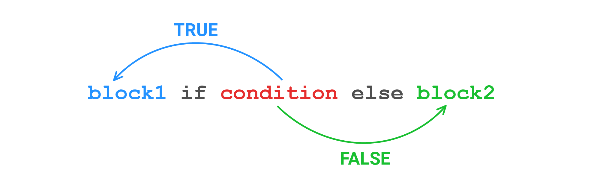

Посмотрите на определение функции, которая возвращает модуль переданного числа:

```python
# Модуль это само число без знака
def abs(number: int) -> int:
    if number >= 0:
        return number
    return -number
```

Но можно записать более лаконично. В Python есть конструкция, которая работает как `if-else`. Она называется **тернарный оператор** и является единственным оператором в Python, который требует три операнда:

```python
def abs(number: int) -> int:
    return number if number >= 0 else -number
```

Общий паттерн выглядит так: `<expression on true> if <predicate> else <expression on false>`.



Давайте перепишем начальный вариант `get_type_of_sentence()` аналогично.

Было:

```python
def get_type_of_sentence(sentence: str) -> str:
    last_char = sentence[-1]
    if last_char == '?':
        return 'question'
    return 'normal'
```

Стало:

```python
def get_type_of_sentence(sentence: str) -> str:
    last_char = sentence[-1]
    return 'question' if last_char == '?' else 'normal'

print(get_type_of_sentence('Hodor'))   # => normal
print(get_type_of_sentence('Hodor?'))  # => question
```

Тернарный оператор можно вкладывать в тернарный оператор. Но это считается плохой практикой, такой код очень сложно понимать.
