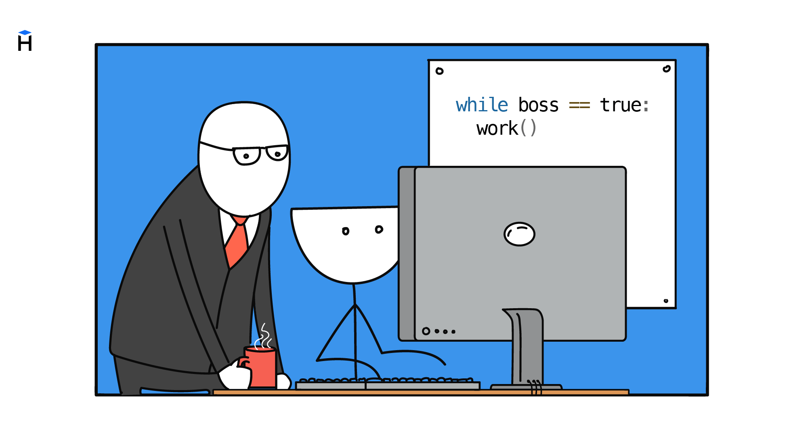

Además de las construcciones condicionales, en programación es imposible arreglárselas sin los bucles. Es un mecanismo especial que permite ejecutar cualquier acción muchas veces. Sobre su base se construyen prácticamente todos los cálculos, desde el recuento de la nota media de un grupo hasta el procesamiento de las peticiones entrantes en los sitios web.



El bucle guarda la acción repetida en un solo lugar y la lanza de nuevo mientras la condición siga siendo verdadera.

## El primer ejemplo

Supongamos que el programa debe mostrar cinco veces la cadena `"Hello!"`. Para detener la repetición en el momento necesario, el programa necesita una variable que guarde el número del paso actual. Esa variable normalmente se llama contador.

En el ejemplo el contador se llama `counter`. Antes del bucle es igual a `0`. Después de cada salida de la cadena lo aumentamos en uno.

```python
counter = 0
while counter < 5:
    print("Hello!")
    counter = counter + 1

# => Hello!
# => Hello!
# => Hello!
# => Hello!
# => Hello!
```

Ahora el bucle puede comprobar el valor del contador antes de cada repetición. Mientras `counter < 5`, se ejecuta el código con sangría bajo la línea `while`. Ese bloque se llama cuerpo del bucle.

Después de ejecutar el cuerpo, el intérprete vuelve a la condición y la comprueba de nuevo. Mientras la condición sea verdadera, el bucle continúa. Cuando la condición se vuelve falsa (`False`), el programa sale del bucle y ejecuta el código siguiente.

Sin modificar el contador, la condición nunca se volverá falsa y el bucle se convertirá en infinito. Desde fuera parece como si el programa se hubiera colgado.

## El funcionamiento del bucle paso a paso

Antes de la primera repetición, `counter` es igual a `0`.

**Paso 1.** El intérprete comprueba `counter < 5`. El valor `0` es menor que `5`, por eso se ejecuta el cuerpo del bucle. En la pantalla se muestra `Hello!` y `counter` aumenta hasta `1`.

**Paso 2.** El intérprete comprueba de nuevo la condición. El valor `1` sigue siendo menor que `5`, por eso el cuerpo del bucle se ejecuta una vez más. En la pantalla se muestra otra vez `Hello!` y `counter` aumenta hasta `2`.

Así continúa hasta que `counter` sea igual a `5`. En la comprobación siguiente, la condición `counter < 5` será falsa, por eso el bucle terminará. Después el programa ejecutará el código que está tras el bucle.

La misma secuencia en un esquema.

```text
counter = 0
┌──→ ¿counter < 5?
│     True │
│          ↓
│    print("Hello!")
│    counter = counter + 1
└──────────┘
      False → salida del bucle
```

Después de terminar el bucle, `counter` es igual a `5` y la cadena `Hello!` se ha impreso cinco veces.

## Sangrías y continuación del programa

Al cuerpo del bucle pertenecen todas las líneas con la misma sangría bajo el `while`. Cuando la sangría termina, termina también el bucle.

```python
counter = 0
while counter < 2:
    print("Hello!")
    counter = counter + 1

print("End of loop")
```

En este ejemplo, `print("Hello!")` y `counter = counter + 1` están dentro del bucle. La línea `print("End of loop")` está sin sangría, por eso se ejecutará una sola vez, después de terminar el bucle.

Por las sangrías Python entiende qué líneas hay que repetir y cuáles van más adelante en el programa.

## Un bucle dentro de una función

Ahora trasladamos el bucle a una función. Imprimirá los números desde `1` hasta el valor recibido.

```python
def print_numbers(n: int) -> None:
    i = 1
    while i <= n:
        print(i)
        i = i + 1
    print("Finished!")


print_numbers(3)
# => 1
# => 2
# => 3
# => Finished!
```

El bucle `while` imprime los números hasta que `i` sea mayor que `n`. Después de eso el programa sale del bucle y ejecuta `print("Finished!")`.

La condición y la modificación del contador dependen de la tarea. El contador se puede aumentar en `1`, en `2` o de golpe en `10`. Se puede disminuir si el bucle va de un valor mayor a uno menor. El contador se puede cambiar no en cada repetición, sino cada dos o después de hacer una comprobación adicional. Lo principal es que la condición se vuelva falsa en algún momento. De lo contrario, el bucle funcionará infinitamente.
