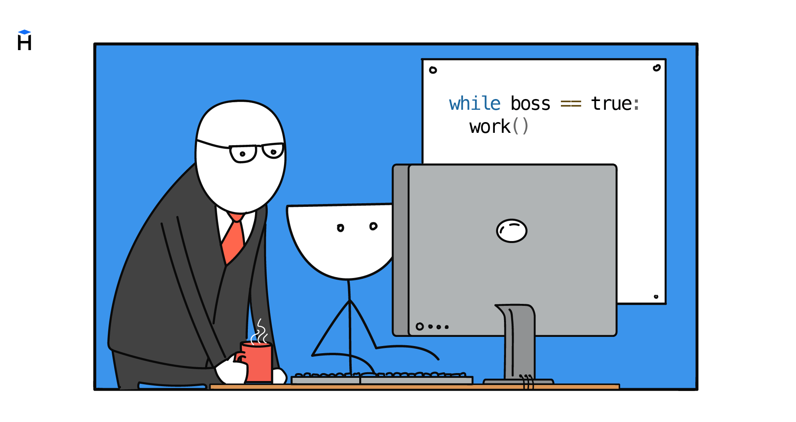

Помимо условных конструкций, в программировании невозможно обойтись без циклов. Это специальный механизм позволяющий выполнять любое действие многократно. На его базе строятся практически любые вычисления от подсчета среднего балла в группе, до обработки входящих запросов на сайтах.



Цикл хранит повторяющееся действие в одном месте и запускает его снова, пока условие остается истинным.

## Первый пример

Пусть программа должна пять раз вывести строку `"Hello!"`. Чтобы остановить повторение в нужный момент, программе нужна переменная, которая хранит номер текущего шага. Такую переменную обычно называют счетчиком.

В примере счетчик называется `counter`. Перед циклом он равен `0`. После каждого вывода строки мы увеличиваем его на единицу.

```python
counter = 0
while counter < 5:
    print("Hello!")
    counter = counter + 1

# => Hello!
# => Hello!
# => Hello!
# => Hello!
# => Hello!
```

Теперь цикл может проверять значение счетчика перед каждым повтором. Пока `counter < 5`, выполняется код с отступом под строкой `while`. Такой блок называют телом цикла.

После выполнения тела интерпретатор возвращается к условию и проверяет его заново. Пока условие истинно, цикл продолжается. Когда условие становится ложным (`False`), программа выходит из цикла и выполняет следующий код.

Без изменения счетчика условие никогда не станет ложным, и цикл превратится в бесконечный. Со стороны это выглядит так, как будто программа зависла.

## Работа цикла по шагам

Перед первым повтором `counter` равен `0`.

**Шаг 1.** Интерпретатор проверяет `counter < 5`. Значение `0` меньше `5`, поэтому выполняется тело цикла.
На экран выводится `Hello!`, а `counter` увеличивается до `1`.

**Шаг 2.** Интерпретатор снова проверяет условие. Значение `1` все еще меньше `5`, поэтому тело цикла выполняется еще раз.
На экран снова выводится `Hello!`, а `counter` увеличивается до `2`.

Так продолжается, пока `counter` не станет равен `5`. При следующей проверке условие `counter < 5` будет ложным, поэтому цикл завершится. Дальше программа выполнит код после цикла.

Та же последовательность на схеме.

```text
  counter = 0
  ┌──→ counter < 5?
  │     True │
  │          ↓
  │    print("Hello!")
  │    counter = counter + 1
  └──────────┘
        False → выход из цикла
```

После завершения цикла `counter` равен `5`, а строка `Hello!` напечатана пять раз.

## Отступы и продолжение программы

К телу цикла относятся все строки с одинаковым отступом под `while`. Когда отступ заканчивается, заканчивается и цикл.

```python
counter = 0
while counter < 2:
    print("Hello!")
    counter = counter + 1

print("End of loop")
```

В этом примере `print("Hello!")` и `counter = counter + 1` находятся внутри цикла. Строка `print("End of loop")` стоит без отступа, поэтому выполнится один раз после завершения цикла.

По отступам Python понимает, какие строки нужно повторять, а какие идут дальше по программе.

## Цикл внутри функции

Теперь перенесем цикл в функцию. Она напечатает числа от `1` до переданного значения.

```python
def print_numbers(n: int) -> None:
    i = 1
    while i <= n:
        print(i)
        i = i + 1
    print("Finished!")

print_numbers(3)
# => 1
# => 2
# => 3
# => Finished!
```

Цикл `while` печатает числа, пока `i` не станет больше `n`. После этого программа выходит из цикла и выполняет `print("Finished!")`.

Условие и изменение счетчика зависят от задачи. Счетчик можно увеличивать на `1`, на `2` или сразу на `10`. Его можно уменьшать, если цикл идет от большего значения к меньшему. Можно менять счетчик не на каждом повторе, а через один или после выполнения дополнительной проверки. Главное, чтобы условие когда-нибудь стало ложным. Иначе цикл будет работать бесконечно.
