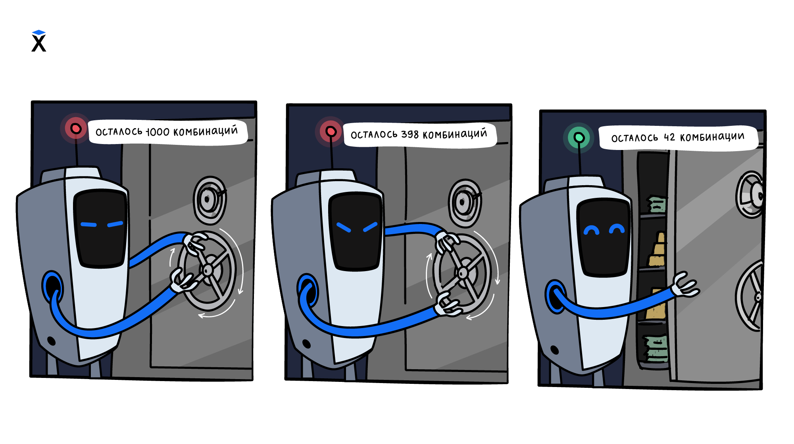

Dentro de un bucle se pueden usar condiciones. Así el programa repite una acción varias veces, pero en cada repetición toma una decisión.



Supongamos que hay que recorrer los números del `1` al `10` e imprimir solo los pares. El bucle recorre todos los números uno tras otro, y la condición dentro del bucle decide cuáles de ellos aparecerán en la pantalla.

Para el recorrido hace falta un contador. Guarda el número actual y aumenta después de cada repetición. Hay que imprimir el número solo cuando pasa la comprobación.

```python
number = 1
while number <= 10:
    if number % 2 == 0:
        print(number)
    number = number + 1

# => 2
# => 4
# => 6
# => 8
# => 10
```

El bucle `while` recorre los números del `1` al `10`. La condición dentro del bucle comprueba el número actual. Si `number % 2 == 0`, el número se divide entre `2` sin resto y el programa lo muestra en la pantalla.

El contador aumenta después de la comprobación en cualquier caso. Eso es importante. Si se aumentara `number` solo dentro del `if`, el bucle se detendría en el primer número impar y funcionaría infinitamente.

## El funcionamiento paso a paso

Antes de la primera repetición, `number` es igual a `1`.

**Paso 1.** La condición del bucle `number <= 10` es verdadera, por eso el programa entra en el cuerpo del bucle. El número `1` es impar, el bloque `if` no se ejecuta. Después `number` aumenta hasta `2`.

**Paso 2.** La condición del bucle es verdadera de nuevo. El número `2` es par, por eso el programa imprime `2`. Después `number` aumenta hasta `3`.

Más adelante el bucle sigue comprobando cada número. Los números impares los omite y los pares los muestra en la pantalla. Cuando `number` sea igual a `11`, la condición `number <= 10` será falsa y el bucle terminará.

## Las condiciones cambian la acción, no el movimiento

En esos bucles resulta cómodo separar dos partes. El contador lleva el programa al valor siguiente, y el `if` decide qué hacer con el valor actual.

```python
number = 1
while number <= 10:
    if number > 5:
        print(number)
    number = number + 1
```

Aquí el bucle recorre el mismo rango del `1` al `10`, pero la condición de dentro es otra. Por eso el programa imprime solo los números mayores que `5`.

La condición dentro del bucle puede comprobar cualquier cosa. Por ejemplo, la paridad del número, la coincidencia de un carácter, la longitud de una cadena o el valor de una variable. Lo principal es que el contador siga cambiando y que el bucle pueda terminar.
