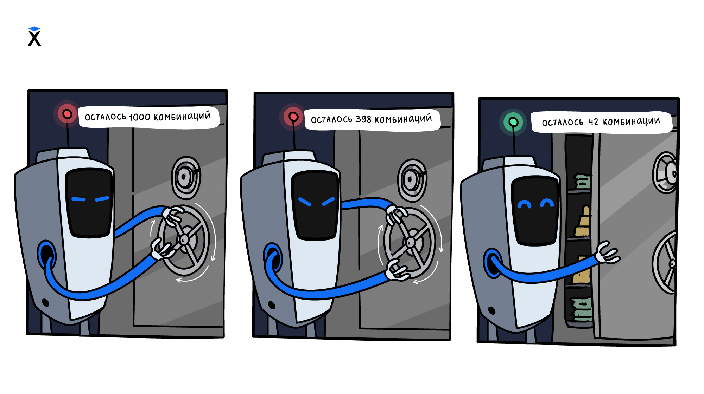

Внутри цикла можно использовать условия. Так программа повторяет одно действие несколько раз, но на каждом повторе принимает решение.



Пусть нужно пройти числа от `1` до `10` и напечатать только четные. Цикл перебирает все числа подряд, а условие внутри цикла решает, какие из них попадут на экран.

Для перебора нужен счетчик. Он хранит текущее число и увеличивается после каждого повтора. Печатать число нужно только тогда, когда оно проходит проверку.

```python
number = 1
while number <= 10:
    if number % 2 == 0:
        print(number)
    number = number + 1

# => 2
# => 4
# => 6
# => 8
# => 10
```

Цикл `while` перебирает числа от `1` до `10`. Условие внутри цикла проверяет текущее число. Если `number % 2 == 0`, число делится на `2` без остатка, и программа выводит его на экран.

Счетчик увеличивается после проверки в любом случае. Это важно. Если увеличивать `number` только внутри `if`, цикл остановится на первом нечетном числе и будет работать бесконечно.

## Работа по шагам

Перед первым повтором `number` равен `1`.

**Шаг 1.** Условие цикла `number <= 10` истинно, поэтому программа входит в тело цикла. Число `1` нечетное, блок `if` не выполняется. Затем `number` увеличивается до `2`.

**Шаг 2.** Условие цикла снова истинно. Число `2` четное, поэтому программа печатает `2`. Затем `number` увеличивается до `3`.

Дальше цикл продолжает проверять каждое число. Нечетные числа он пропускает, а четные выводит на экран. Когда `number` станет равен `11`, условие `number <= 10` станет ложным, и цикл завершится.

## Условия меняют действие, а не движение

В таких циклах удобно разделять две части. Счетчик переводит программу к следующему значению, а `if` решает, что делать с текущим значением.

```python
number = 1
while number <= 10:
    if number > 5:
        print(number)
    number = number + 1
```

Здесь цикл проходит тот же диапазон от `1` до `10`, но условие внутри другое. Поэтому программа печатает только числа больше `5`.

Условие внутри цикла может проверять что угодно. Например, четность числа, совпадение символа, длину строки или значение переменной. Главное, чтобы счетчик продолжал меняться, и цикл мог завершиться.
