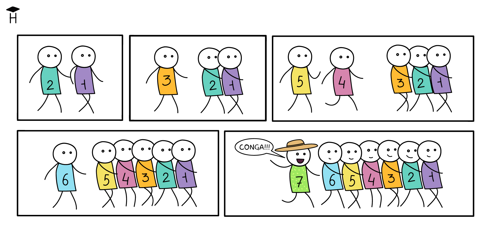

Una clase aparte de tareas que no se resuelven sin bucles se llama **agregación de datos**. A esas tareas pertenecen la búsqueda del valor máximo o mínimo, de la suma o de la media aritmética. En su caso el resultado depende de todo el conjunto de datos. En esta lección analizaremos cómo se aplica la agregación a los números y a las cadenas.



Supongamos que necesitamos encontrar la suma de un conjunto de números. Implementemos una función que suma los números de un rango indicado, incluidos los límites. Un **rango** es una serie de números desde un principio concreto hasta un final determinado. Por ejemplo, el rango [1, 10] incluye los números enteros del uno al diez.

Un ejemplo:

```python
sum_numbers_from_range(5, 7)  # 5 + 6 + 7 = 18
sum_numbers_from_range(1, 2)  # 1 + 2 = 3

# [1, 1] un rango con el mismo principio y final también es un rango
# Incluye un solo número: el límite mismo del rango
sum_numbers_from_range(1, 1)      # 1
sum_numbers_from_range(100, 100)  # 100
```

Para implementar ese código hará falta un bucle, ya que sumar números es un proceso iterativo, es decir, se repite para cada número. La cantidad de iteraciones depende del tamaño del rango. Este es el código de esa función:

```python
def sum_numbers_from_range(start: int, finish: int) -> int:
    # Técnicamente se puede modificar start
    # Pero los argumentos de entrada hay que dejarlos en su valor original
    # Eso hace el código más simple de analizar
    i = start
    sum = 0  # Inicialización de la suma
    while i <= finish:  # Avanzamos hasta el final del rango
        sum = sum + i   # Calculamos la suma para cada número
        i = i + 1       # Pasamos al número siguiente del rango
    # Devolvemos el resultado obtenido
    return sum
```

La estructura del bucle aquí es la estándar. Hay un contador que se inicializa con el valor inicial del rango, un bucle con la condición de parada al alcanzar el final del rango y la modificación del contador al final del cuerpo del bucle. La cantidad de iteraciones en ese bucle es igual a `finish - start + 1`. Para el rango [5, 7] eso es 7 - 5 + 1, es decir, tres iteraciones.

La diferencia principal con el procesamiento normal está en la lógica del cálculo del resultado. En las tareas de agregación siempre hay una variable que guarda dentro de sí el resultado del trabajo del bucle. En el código de arriba es `sum`. En cada iteración del bucle se le añade el número siguiente del rango: `sum = sum + i`.

De forma visual, ese proceso se ve de la siguiente manera.

```python
# Para la llamada sum_numbers_from_range(2, 5)
sum = 0
sum = sum + 2  # 2
sum = sum + 3  # 5
sum = sum + 4  # 9
sum = sum + 5  # 14
# 14 es el resultado de sumar los números del rango [2, 5]
```

De forma visual, el proceso de acumulación de la suma se ve así.

```text
sum_numbers_from_range(2, 5):

i=2: sum = 0 + 2 = 2
i=3: sum = 2 + 3 = 5
i=4: sum = 5 + 4 = 9
i=5: sum = 9 + 5 = 14
                    └── resultado
```

La variable `sum` tiene un valor inicial con el que empieza cualquier operación repetida. En el ejemplo de arriba es `0`. ¿Por qué así?

En matemáticas existe el concepto de **elemento neutro**, y cada operación tiene el suyo. La operación con ese elemento no modifica el valor sobre el que trabaja. Por ejemplo, en la suma cualquier número más cero da el número mismo. En la resta el elemento neutro es el mismo: 0. En la concatenación el elemento neutro es la cadena vacía: `'' + 'one'` será 'one'. Por eso, si multiplicáramos, en lugar de `0` usaríamos `1`.
